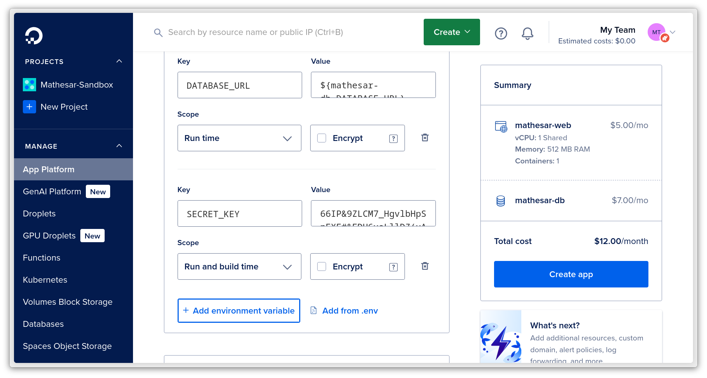

# Install Mathesar on DigitalOcean

This guide walks you through how to deploy Mathesar on DigitalOcean via their App Platform.

??? tip "DigitalOcean vs. other deployment methods"	
	Deploying using DigitalOcean works really well for:  
	
	- Users who are new to self-hosting, but need a permanent installation.
	- Users who do not have the capacity or interest in manually managing server infrastructure.
	- Users who would prefer configuring Mathesar primarily through GUI tools rather than CLI tools.

	If you need more flexibility or configurability, we recommend using our [Docker Compose](./install-via-docker-compose.md) or [direct](./install-from-scratch.md) installation methods instead.

## Installation

### Step 1: Run the one-click deployer

!!! info "DigitalOcean account recommended"
	Although you do not need a DigitalOcean account for this process, we've found that the process goes more smoothly if you set up an account first. You can do this [here](https://cloud.digitalocean.com/registrations/new). Be sure you have a [payment method added](https://cloud.digitalocean.com/account/billing) too.

### Step 2: Generate a secret key

!!! danger "Do not share this key with anyone"
	The `SECRET_KEY` is used to encrypt user data in your database. **Be sure to keep it secret.**

1\. **Important.** Secure your installation with a `SECRET_KEY` . 

Press the button below to generate a key, and automatically copy it. 

  

2\. Add a `SECRET_KEY` environment variable in the DigitalOcean UI. You can do this by: 

  - Clicking the "Edit" button next to the "Environment Variables" header.
  - Then clicking the "Add environment variable" button. 

When completed, Digital Ocean should look something like this:

### Step 3: Create the application

**Press the "Create App" button.**

It will take a few minutes for DigitalOcean to set up your installation. Once ready, you will see your domain name and a link to visit your new Mathesar site.

### Step 4: Set up an admin user account

Navigate to your Mathesar installation using the link that DigitalOcean shows you.

You’ll be prompted to set up an admin user account the first time you open Mathesar. Just follow the instructions on screen.

### Step 5: Upgrade your database (optional)

By default, this installation uses a DigitalOcean "dev database", which does not allow you to create new databases.

If you plan to create new databases within Mathesar, you will need to upgrade your database to one of Digital Ocean's "managed databases". Here are DigitalOcean's [instructions for how to upgrade](https://docs.digitalocean.com/products/app-platform/how-to/manage-databases/#upgrade-dev-database-to-managed-database), just follow those.

Managed databases also give you automated daily backups of your database, so we recommend them for all permanent setups.

Please note that managed databases cost a few dollars more per month. You can [learn more about them here](https://www.digitalocean.com/products/managed-databases).

### Step 6: Additional setup (optional)

Congratulations on your new Mathesar install! 

Here are some other things you can do to complete your Mathesar setup, depending on your needs:

- [Connect your existing database(s) to Mathesar](../user-guide/databases.md#connection) to begin working with your data.
- [Set up a custom domain name using DigitalOcean's control panel](https://docs.digitalocean.com/products/app-platform/how-to/manage-domains/#custom-domain) if you don't want to use their default domain e.g. `https://mathesar-*.ondigitalocean.app/`.
