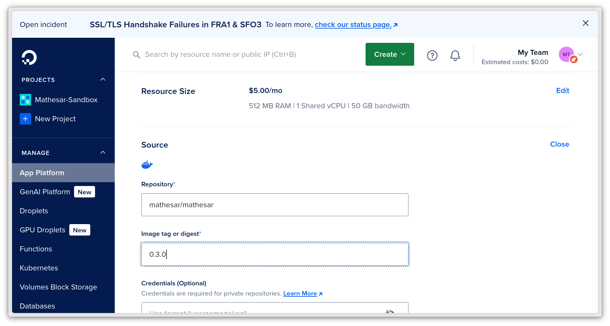

# One-click Install Mathesar on DigitalOcean App Platform

Install Mathesar to DigitalOcean in minutes using the simple instructions below.

## Why Choose DigitalOcean App Platform?

[DigitalOcean App Platform](https://www.digitalocean.com/products/app-platform) simplifies deploying, scaling, and managing Mathesar without worrying about underlying infrastructure management. It's ideal for:

- Beginners who need an easy, quick setup without delving into infrastructure specifics.
- Small to medium-sized teams looking for reliable hosting with minimal overhead.
- Developers who prefer easy scaling, clear pricing, and stability without needing to SSH into servers or manually manage configuration.

## Instructions to install Mathesar on DigitalOcean App Platform

1\. [Create](https://cloud.digitalocean.com/registrations/new) or log in to an existing DigitalOcean account. You can do this later, but it's simplest to start with this first. Be sure to [add a payment method](https://cloud.digitalocean.com/account/billing) to your account if you haven't yet.

2\. Use the DigitalOcean one-click install button to initialize a new Mathesar install in DigitalOcean:
    

3\. **Important.** Secure your installation with a `SECRET_KEY` . Press the button below to generate a key, and automatically copy it. **Be sure to keep this key secret.**

  

4\. Add a `SECRET_KEY` environment variable. Click the "Edit" button next to the "Environment Variables" heading, then the "Add environment variable" button. When completed, Digital Ocean should look something like this:

5\. Press the "Create App" button.

In a few minutes, you'll have a live Mathesar installation ready to use! Digital Ocean will display your domain name and a link to visit your new site. You’ll be prompted to set up an admin user account the first time you open Mathesar. Just follow the instructions on screen.

### Default database limitations

By default, your Mathesar instance will use a Digital Ocean "Dev DB". For most users who wish to connect Mathesar to an existing database, this is fine. However, for users who need to create new Mathesar-connected databases on Digital Ocean, you'll need to switch to using one of Digital Ocean's "Managed DBs". This will cost a few additional dollars per month.

See DigitalOcean's [instructions for converting](https://docs.digitalocean.com/products/app-platform/how-to/manage-databases/#upgrade-dev-database-to-managed-database) to get started, or [learn more about Managed Databases on the DigitalOcean platform](https://www.digitalocean.com/products/managed-databases).

## After installing Mathesar

Congratulations on your new Mathesar install! After getting up in running, you may want to take some additional steps:

### Connect your production database(s)

See our [instructions for connecting Databases to Mathesar](../user-guide/databases.md#connection) to begin working with your data.

### Add a custom domain name (optional)

By default, Digital Ocean will give your Mathesar installation its own secured domain name, like `https://mathesar-*.ondigitalocean.app/`.

You can easily add a custom domain name by following Digital Ocean's guide on [Adding a custom domain using their control panel](https://docs.digitalocean.com/products/app-platform/how-to/manage-domains/#custom-domain).

### Enable backups on the Mathesar Internal DB

If you'd like automated daily snapshots of your database and other features, you'll want to upgrade to one of Digital Ocean's "Managed DBs". See the earlier ["Default database limitations"](#default-database-limitations) section to learn more.

### Pin a specific version of Mathesar

By default your Mathesar instance will automatically update to the latest version if you redeploy your app and a new version of Mathesar is available.

If you wish to stick to a specific version of Mathesar, find your desired version number on our [releases page](https://github.com/mathesar-foundation/mathesar/releases) and edit the "Source" of the `mathesar-web` component, changing "latest" to your desired version:

