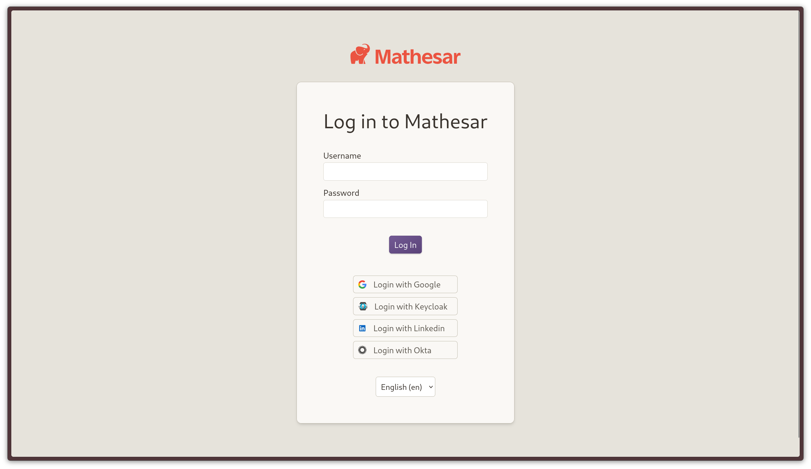

# Single Sign-on (SSO)



Single Sign-on (SSO) allows users to log into Mathesar with their existing company credentials, enabling seamless and secure access without the need to create or manage a separate account.

Mathesar supports any identity provider that implements the [OpenID Connect (OIDC) standard](https://openid.net/developers/how-connect-works/), such as Okta, Azure Active Directory, Google Workspace, and others.

This guide is intended for IT admins or developers who are configuring secure access to Mathesar. SSO in Mathesar is configured outside of the application interface, using a straightforward configuration file.

The following sections will walk you through how to configure your identity provider and enable SSO for your organization.

## Enabling and configuring SSO

To enable Single Sign-On (SSO) in Mathesar, begin by creating a file named `sso.yml`. This file serves as the configuration point for all identity provider (IdP) integrations using OIDC.

Without this configuration file, Mathesar will default to supporting only traditional email and password-based authentication.

Instructions for where to save the file vary slightly, depending on which installation method you've used:

=== "For Docker Compose installations"

    For [docker compose](./install-via-docker-compose.md) installations, create a `sso.yml` file next to your `docker-compose.yml` file and the `msar` directory.

    This file is automatically mounted to the container in our [default `docker-compose.yml` file](https://github.com/mathesar-foundation/mathesar/raw/0.3.0/docker-compose.yml).

    If you've modified your docker compose file in any way, make sure that you're mounting a `sso.yml` file to `/code/sso.yml` within the container before continuing.

=== "For Linux, macOS, or WSL installations"

    For [non-Docker installations](./install-from-scratch.md), you'll need to create the `sso.yml` file in the installation directory you [defined while installing](./install-from-scratch.md#set-up-your-installation-directory) Mathesar.

### Setting up your identity provider

Once you've created the `sso.yml` file, the next step is to configure your identity provider (IdP) to work with Mathesar.

Although all supported IdPs adhere to the same OIDC specification, each provider has a different interface and process for registering and managing applications.

???tip "Example Identity Providers"
     Here are several popular identity providers that should work with Mathesar's OIDC SSO implementation. Where possible, we've linked to relevant documentation about configuring each provider.

    | Provider      | Key           |
    |---------------|---------------|
    | [Apple](https://support.apple.com/guide/apple-business-manager/federated-authentication-identity-provider-axmfcab66783/web)         | `apple`       |
    | [Auth0](https://auth0.com/docs/get-started/auth0-overview/create-applications)         | `auth0`       |
    | [GitLab](https://docs.gitlab.com/integration/openid_connect_provider/)        | `gitlab`      |
    | [Google](https://support.google.com/a/answer/12032922#OIDC_setup)        | `google`      |
    | [Kakao](https://developers.kakao.com/docs/latest/en/kakaologin/utilize#oidc)         | `kakao`       |
    | [Keycloak](https://www.keycloak.org/securing-apps/oidc-layers)      | `keycloak`    |
    | [LinkedIn](https://learn.microsoft.com/en-us/linkedin/consumer/integrations/self-serve/sign-in-with-linkedin-v2)      | `linkedin`    |
    | [Microsoft](https://learn.microsoft.com/en-us/entra/identity-platform/v2-protocols-oidc)     | `microsoft`   |
    | [Okta](https://developer.okta.com/docs/guides/sign-into-web-app-redirect/asp-net-core-3/main/#create-an-app-integration-in-the-admin-console)          | `okta`        |

    See broken links or something wrong? Please [file an issue](https://github.com/mathesar-foundation/mathesar/issues/new?template=bug_report.md).

 After creating an application or client per your IdP's documentation, configure the Callback URL (sometimes called the Login URL or Redirect URL) with the following value:

```
https://mathesar.example/auth/oidc/<provider-name>/login/callback/
```

!!!tip "Configuring the callback URL"
    Replace `<mathesar-domain>` with the domain name of your Mathesar installation.<br>
    Examples: `https://mathesar.myorg.com`, `localhost:8000`

    Replace `<provider-name>` with the name of your IdP provider.<br>
    Examples: `auth0`, `okta`, `google`

After configuring your IdP, retrieve the OIDC "client_id" and "secret" (sometimes called "client secret", "secret key", or "token") from your IdP, and add them to your `sso.yml` config file:

```diff
oidc_providers:
  provider1:
    provider_name: okta
    server_url: https://trial-example-admin.okta.com
+   client_id: 0oatafg35rDG2KVQD697
+   secret: 8xvA3s6pzl9cx7fit7LZ3RIZhAGgG9Rst509dijCVBXwKL3ijpjHbmPDPa0WXln1
```

### For existing Mathesar instances

If you'd like to enable SSO on an existing Mathesar instance, simply create and configure the `sso.yml` file using the instructions below. Existing users will now have the option to log in with SSO. If their existing email address matches a configured provider, they will be able to log into their existing account.

## Disabling SSO

To disable Single Sign On, you can remove the `sso.yml` file and restart Mathesar. It is _highly likely_ you will want to have an administrator user reset all user passwords.
