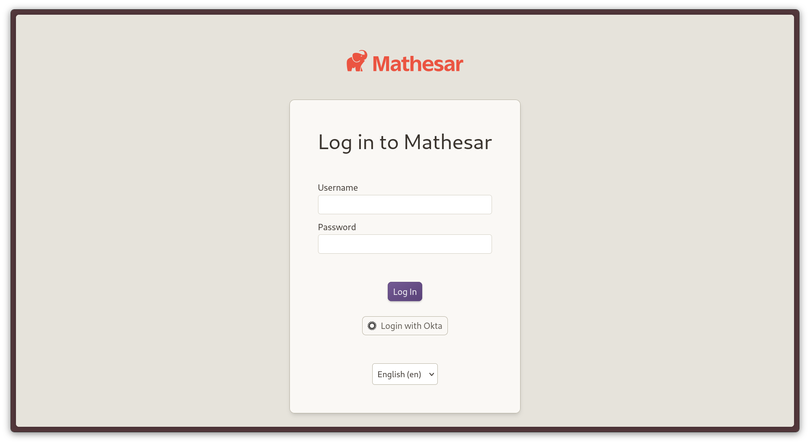

# Single Sign-on (SSO)

Single sign-on (SSO) allows users to log into your Mathesar instance without the need to create or manage separate accounts.

This guide explains how to configure SSO for Mathesar. It is intended for IT and system administrators familiar with setting up identity providers and managing a Mathesar instance.

## 1. Setting up your identity provider

First, you'll need to configure your identity provider (IdP) to work with Mathesar. Mathesar supports any identity provider that implements the [OpenID Connect (OIDC) standard](https://openid.net/developers/how-connect-works/), such as Okta, Azure Active Directory, Google Workspace, and others.

Below is a list of commonly used identity providers compatible with Mathesar’s OIDC-based SSO. Where possible, we’ve included links to their setup documentation:

| Provider      | Key         |
|---------------|---------------|
| [Apple](https://support.apple.com/guide/apple-business-manager/federated-authentication-identity-provider-axmfcab66783/web)         | `apple`       |
| [Auth0](https://auth0.com/docs/get-started/auth0-overview/create-applications)         | `auth0`       |
| [GitLab](https://docs.gitlab.com/integration/openid_connect_provider/)        | `gitlab`      |
| [Google](https://support.google.com/a/answer/12032922#OIDC_setup)        | `google`      |
| [Kakao](https://developers.kakao.com/docs/latest/en/kakaologin/utilize#oidc)         | `kakao`       |
| [Keycloak](https://www.keycloak.org/securing-apps/oidc-layers)      | `keycloak`    |
| [LinkedIn](https://learn.microsoft.com/en-us/linkedin/consumer/integrations/self-serve/sign-in-with-linkedin-v2)      | `linkedin`    |
| [Microsoft](https://learn.microsoft.com/en-us/entra/identity-platform/v2-protocols-oidc)     | `microsoft`   |
| [Okta](https://developer.okta.com/docs/guides/sign-into-web-app-redirect/asp-net-core-3/main/#create-an-app-integration-in-the-admin-console)          | `okta`        |

To get started, create an application within your chosen provider.

During this process, you'll be asked to specify a "Callback URL" (also called a Redirect URI or Login URL, depending on the provider). This is the URL your identity provider uses to return users to Mathesar after a successful login.

!!!info "Configuring the callback URL"
    In your provider's settings, set the Callback URL to:

    ```
    https://<mathesar-domain>/auth/oidc/<provider-name>/login/callback/
    ```

    Replace `<mathesar-domain>` with the domain name of your Mathesar installation.<br>
    Examples: `mathesar.myorg.com`, `localhost:8000`

    Replace `<provider-name>` with the key of your IdP provider.<br>
    Examples: `auth0`, `okta`, `google`

Your identity provider will redirect users to this URL after authentication, so it’s important that the value matches exactly in both your IdP configuration and your Mathesar setup.

Once your IdP is configured, you can move on to the next steps: enabling SSO in Mathesar and configuring it  with the required values from your provider.

## 2. Enabling SSO in Mathesar

To enable SSO in Mathesar, you'll configure it outside the app's user interface using a simple configuration file named `sso.yml`.

This file contains all the necessary settings for your identity provider (IdP) and tells Mathesar how to handle authentication.

???+info "Using the OIDC_CONFIG_DICT environment variable instead of sso.yml"
    If Mathesar deployed in an environment where writing to the local filesystem isn't possible (e.g., a cloud platform with an ephemeral filesystem), you can use the `OIDC_CONFIG_DICT` environment variable instead of a sso.yml file.

    This variable must contain the same configuration data as `sso.yml`, but converted to JSON and then stringified. Here's an example of the final result:

    ```env
    OIDC_CONFIG_DICT="{\"version\": 1,\"oidc_providers\": {\"provider1\": {\"provider_name\": \"okta\",\"client_id\": \"client-id\",\"secret\": \"client-secret\",\"server_url\": \"https://trial-2872264-admin.okta.com\"}}}"
    ```

    To create this, convert your `sso.yml` contents to JSON, then wrap the result in quotes and escape any internal quotation marks. Get additional help in our [environment variables guide](./environment-variables.md#oidc_config_dict-optional).

Instructions for where to save the `sso.yml` file vary slightly, depending on which installation method you've used:

=== "For Docker Compose installations"

    For [docker compose](./install-via-docker-compose.md) installations, create a `sso.yml` file next to your [`docker-compose.yml` file](https://github.com/mathesar-foundation/mathesar/raw/{{mathesar_version}}/docker-compose.yml):

    ```diff
    mathesar
     ├── docker-compose.yml
     ├── msar/
    +└── sso.yml
    ```

    Then, uncomment the following lines in your docker compose file:

    ```diff
     volumes:
       - ./msar/static:/code/static
       - ./msar/media:/code/media
     # Uncomment the following to mount sso.yml and enable Single Sign-On (SSO).
    -# - ./sso.yml:/code/sso.yml
    +  - ./sso.yml:/code/sso.yml
    ```

=== "For Linux, macOS, or WSL installations"

    For [non-Docker installations](./install-from-scratch.md), you'll need to create the `sso.yml` file in the installation directory you [defined while installing](./install-from-scratch.md#set-up-your-installation-directory) Mathesar.

Once the file is created, paste in our [example configuration](https://github.com/mathesar-foundation/mathesar/raw/{{mathesar_version}}/sso.yml.example). You'll edit this configuration in the following steps to work with your provider.

## 3. Configuring the identity provider in Mathesar

With your identity provider (IdP) set up and the `sso.yml` file created, you're ready to configure Mathesar to use your provider.

We'll use Okta as the example, but the same format applies to other providers like Auth0 or Google.

### Naming Your Provider

Each provider is defined under a unique key (e.g., provider1). Inside that block, you must specify the following:

- `provider_name`: A lowercase, alphanumeric identifier that matches the value used in your callback URL.
- `server_url`: The OIDC issuer or discovery URL provided by your IdP. Mathesar uses this to fetch OIDC metadata, including authorization and token endpoints.

Examples of `server_url` values:

- Okta: `https://your-org.okta.com`
- Auth0: `https://your-tenant.auth0.com`
- Google: `https://accounts.google.com` (typically a fixed value)

Refer to your IdP's documentation for the exact value.

Here’s how to start defining your first provider in `sso.yml`:

```diff
# This config file allows you to configure OpenID Connect(OIDC)
# based Single Sign-On(SSO) for logging into Mathesar with your preferred
# Identity Provider(IdP).
version: 1
oidc_providers:
+  provider1:
+    provider_name: okta
+    server_url: https://your-org.okta.com
```

### Configuring your provider

Next, retrieve the following credentials from your IdP’s admin interface:

- `client_id`
- `secret` (also referred to as client secret, token, or client key)

These allow Mathesar to securely authenticate with your identity provider.

Add them to the same provider block:

```diff
  provider1:
    provider_name: okta
    server_url: https://trial-example-admin.okta.com
+   client_id: client-id
+   secret: client-secret
```

You've now completed the **minimum required configuration** to enable SSO in Mathesar.

Next, you can explore optional (but **recommended**) features like:

- [Restricting access to particular email domains](#restrict-access-to-specific-email-domains)
- [Setting default database roles](#set-default-user-roles-for-your-databases)

You can also repeat this process for any additional providers.

## 4. Activating SSO

To activate Single sign-on, restart Mathesar so it can load the updated `sso.yml` file.

=== "For Docker Compose installations"

    ```bash
    docker compose -f docker-compose.yml down
    docker compose -f docker-compose.yml up -d
    ```

=== "For Linux, macOS, or WSL installations"

    ```bash
    sudo systemctl restart mathesar.service
    ```

Visit your Mathesar installation and you should see your provider on the login screen:


/// caption
Mathesar's login screen with Okta SSO enabled.
///

## Additional configuration options

You can extend the providers in your `sso.yml` file with additional settings to restrict access and define default roles for users. These fields are optional, but **highly recommended** for tightening security and streamlining user provisioning.

### Restrict access to specific email domains

Use the `allowed_email_domains` setting to restrict SSO logins to specific email domains. This is useful if your identity provider manages multiple domains or if you want to prevent unauthorized domains from accessing your Mathesar instance.

- **Default:** No restriction (i.e., users from any domain can log in).
- **Expected format:** A list of domain names (e.g., `['example.com', 'mathesar.org']`).

**Example:**

```diff
oidc_providers:
  provider1:
    provider_name: okta
    server_url: https://trial-example-admin.okta.com
    client_id: YOUR_CLIENT_ID
    secret: YOUR_SECRET
+   allowed_email_domains: ['example.com', 'mathesar.org']
```

With this configuration, only users whose email ends in `@example.com` or `@mathesar.org` will be allowed to log in.

---

### Set default user roles for your databases

The `default_pg_role` block allows you to **automatically assign PostgreSQL roles** to users the first time they log in via SSO. You can configure this for one or more databases.

Each database block must include the following:

- `name`: The **PostgreSQL database name**
- `host`: The **hostname** or IP address of the database
- `port`: The **port** on which the database is running
- `role`: The **PostgreSQL role** to assign to users

**Example:**

```diff
oidc_providers:
  provider1:
    provider_name: okta
    server_url: https://trial-example-admin.okta.com
    client_id: YOUR_CLIENT_ID
    secret: YOUR_SECRET
+   default_pg_role:
+     db1:
+       name: my_database
+       host: db.internal.example.com
+       port: 5432
+       role: readonly_user
+     db2:
+       name: analytics_db
+       host: analytics-db.example.net
+       port: 5432
+       role: analyst
```

On first login, users will be granted the specified roles on each listed database. This simplifies onboarding and ensures consistent access control across your environment.

#### Overriding automatic role provisioning

If you wish to _override_ default role provisioning for specific users, you can manually create their user accounts in the Mathesar UI and assign DB roles directly. When those users log in via SSO for the first time, Mathesar will preserve the roles you set, instead of applying the default roles defined in the SSO provider configuration.

!!!info "Example scenario"
    **Company A** wants all employees to have read-only access by default, but account managers should have write access.

    In their `sso.yml`, they set the default role to `readonly`. Then, before enabling SSO, they manually create Mathesar accounts for each account manager and assign them the `writeaccess` role in the appropriate database.

    When account managers log in via SSO, Mathesar recognizes their email addresses and preserves the `writeaccess` roles, instead of applying the default `readonly` role.

## Transitioning Existing Users to SSO

If you already have users in Mathesar and want them to start using SSO, you can do so without disrupting their accounts, **as long as the email address used for SSO matches their existing Mathesar account email exactly**.

When a user logs in via SSO, Mathesar checks for a matching email address. If a match is found, the user will be logged into their existing Mathesar account. Their roles and access will remain intact.

#### Steps to prepare:

- **Verify email addresses**: Make sure the email for each existing user in Mathesar exactly matches the email returned by your identity provider.
- **Update emails if needed**: If necessary, update existing Mathesar user emails before enabling SSO.

#### Admin caveats:

* **SSO for the default admin account**: If you're using a fresh Mathesar install and want to link the default admin account to an SSO identity, make sure the SSO user has the **same email address** as the admin account created during setup.
  Once SSO is enabled, logging in via SSO with that email will connect the SSO identity to the existing admin account.
* **No admin account creation via SSO (yet)**: At this time, Mathesar does not support creating admin accounts through SSO. Admins must be created manually in the Mathesar UI before SSO is enabled.

This approach allows you to adopt SSO gradually while keeping access and roles intact.

## Disabling Single Sign-on

To disable SSO in Mathesar, delete the `sso.yml` file from your installation directory (or remove the value of the `OIDC_CONFIG_DICT` variable) and restart Mathesar. This will revert Mathesar to using only email and password-based authentication.

!!!danger "Resetting user passwords"
    Users who were originally created via SSO do not have a known password—they are automatically assigned a random, system-generated one during account creation. As a result, these users will not be able to log in after SSO is disabled unless their passwords are reset.

    To restore access for these users:

    1. Have an administrator reset each user’s password through the Mathesar user interface.
    2. When the user logs in with the administrator-supplied password, they will be prompted to create a new personal password.

    We recommend completing all necessary password resets before disabling SSO to ensure a smooth transition and avoid user lockouts.
