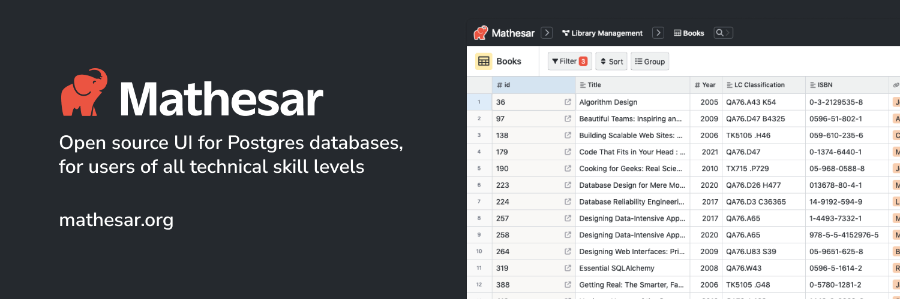

# Mathesar Documentation

Mathesar is a straightforward open source tool that provides a **spreadsheet-like interface** to a PostgreSQL **database**. Our web-based interface helps you and your collaborators work with data more independently and comfortably – **no technical skills needed**.

You can use Mathesar to build **data models**, **enter data**, and even **build reports**.

## Installation
You host Mathesar on your own server. Currently, we only support installing using Docker Compose, although we will support additional installation methods soon.

- [Install with Docker Compose](installation/docker-compose.md).
- [Install with Docker Compose on Ubuntu](installation/ubuntu.md).
- [Install with Docker Compose on Debian](installation/debian.md).
- [Install with Docker Compose on CentOS](installation/centos.md).

