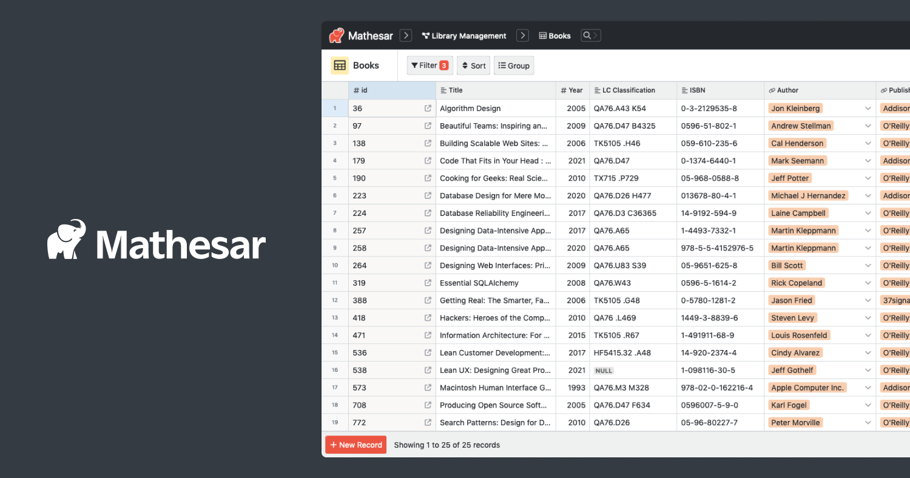

# Mathesar Documentation

Mathesar is a straightforward open source tool that provides a **spreadsheet-like interface** to a PostgreSQL **database**. Our web-based interface helps you and your collaborators work with data more independently and comfortably – **no technical skills needed**.

You can use Mathesar to build **data models**, **enter data**, and even **build reports**.

## Installation

[Install Mathesar](install/index.md)

## Product
Mathesar should be pretty intuitive to use. More documentation is coming soon, but for now, we've written some documentation for some things that could be tricky.

- [Syncing Database Changes](product/syncing-db.md)
- [Users & Access Levels](product/syncing-db.md)

## Contributing
We welcome contributions! Please read through our [contribution guide on our wiki](https://wiki.mathesar.org/en/community/contributing) to get started.

- [Local Development Setup](contributing/local-dev.md)