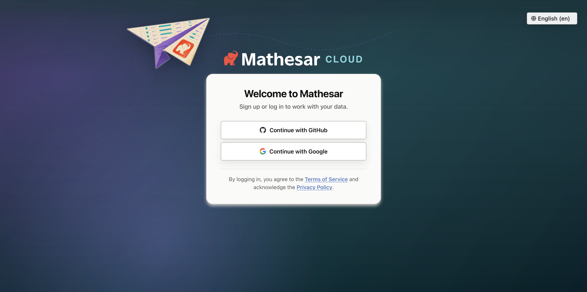

# Mathesar 0.12.0

## Summary

Mathesar 0.12.0 focuses on deployment and administration improvements. This release adds Azure Blob Storage support for file attachments and imported data files, health check endpoints for containerized deployments, and more configuration options for public entry and login pages.

It also disables Django's built-in admin interface by default, improves the login and SSO experience, fixes several issues affecting anonymous routes and Azure-hosted PostgreSQL databases, and includes documentation, translation, and maintenance updates.

!!! info ""
	This page provides a comprehensive list of all changes in the release.

## Improvements

### Azure Blob Storage support

Mathesar can now use Azure Blob Storage for file columns. Administrators can configure a file backend with `protocol: az` in `file_storage.yml` or `FILE_STORAGE_DICT`. For file-column storage, the Azure backend supports managed identity and workload identity through `DefaultAzureCredential`, as well as account keys, SAS tokens, connection strings, and service principals.

Imported data files can also be stored in Azure Blob Storage by setting `DATA_FILES_STORAGE_BACKEND=azure` and configuring the Azure storage account and container. The data-file Azure backend authenticates through `DefaultAzureCredential`. Data-file imports now read through Django's storage API instead of assuming a local file path, and Mathesar stores the detected file encoding with each imported data file.

See the [file storage backend documentation](../administration/file-backend-config.md) and [environment variable documentation](../administration/environment-variables.md#datafiles-storage) for configuration details.

*Related work:* [#5287](https://github.com/mathesar-foundation/mathesar/pull/5287 "Fix azure blob storage uploads for data-files"), [#5298](https://github.com/mathesar-foundation/mathesar/pull/5298 "Add azure blob storage support for file attachments")

### Customizable public entry and login pages


///caption
The login page can now show custom branding, localized copy, SSO options, and legal links.
///

Administrators now have more control over Mathesar's public-facing experience. Anonymous visitors who open `/` can be redirected to a custom URL with `MATHESAR_LANDING_PAGE_URL`, which is useful for hosted deployments with a separate marketing or onboarding page.

The login page now supports a custom instance name, logo, localized heading and body copy, background, and Terms of Service and Privacy Policy links. Custom login text can be configured in `login_page.yml` or through `MATHESAR_LOGIN_PAGE_TEXT_DICT`, including per-language overrides.

The login page has also been visually refreshed, SSO buttons now use clearer copy, and contextual header gradients have been refined.

See the [public entry and login page configuration documentation](../administration/environment-variables.md#public-entry) for configuration details.

*Related work:* [#5301](https://github.com/mathesar-foundation/mathesar/pull/5301 "Add custom landing page url redirection support"), [#5312](https://github.com/mathesar-foundation/mathesar/pull/5312 "Add TOS and Privacy Policy links to login template"), [#5316](https://github.com/mathesar-foundation/mathesar/pull/5316 "Login page changes."), [#5317](https://github.com/mathesar-foundation/mathesar/pull/5317 "Update SSO login button copy"), [#5318](https://github.com/mathesar-foundation/mathesar/pull/5318 "Improve header gradients"), [#5319](https://github.com/mathesar-foundation/mathesar/pull/5319 "Made login page text translatable.")

### Django admin disabled by default

Django's built-in admin interface at `/admin/` is now disabled by default. This does not affect Mathesar's own administration pages under `/administration/`. Administrators who still need Django admin can re-enable it by setting `MATHESAR_DJANGO_ADMIN_ENABLED=true`.

*Related work:* [#5316](https://github.com/mathesar-foundation/mathesar/pull/5316 "Login page changes.")

### Health check endpoints

Mathesar now serves dedicated health check endpoints for deployment platforms and container orchestrators:

- `/healthz/live/` returns a liveness response without touching the database.
- `/healthz/ready/` checks database connectivity and returns `503` if Mathesar is not ready to serve traffic.

These endpoints are handled before host validation, SSL redirects, and authentication. The default Docker Compose health check now uses the readiness endpoint.

*Related work:* [#5291](https://github.com/mathesar-foundation/mathesar/pull/5291 "Add a health check middleware with live and readiness endpoints")

### Minimal production Docker stage

The Dockerfile now includes a `minimal` production stage for deployments that do not need the bundled PostgreSQL server. This stage is intended for people building their own Mathesar image. It collects static assets at build time, runs as an unprivileged `mathesar` user, and starts Mathesar without the inbuilt database fallback.

*Related work:* [#5286](https://github.com/mathesar-foundation/mathesar/pull/5286 "Add a Docker stage for minimal production setup")


## Bug fixes

- Fix permission errors when provisioning user-owned databases on Azure-hosted PostgreSQL. Mathesar now grants `CREATE` on the target database's `public` schema from the root role [#5284](https://github.com/mathesar-foundation/mathesar/pull/5284 "Fix public schema permissions"), [#5296](https://github.com/mathesar-foundation/mathesar/pull/5296 "Merge pull request #5284 from mathesar-foundation/fix_public_schema_permissions"), [#5302](https://github.com/mathesar-foundation/mathesar/pull/5302 "Use root_conn for grant create on public"), [#5305](https://github.com/mathesar-foundation/mathesar/pull/5305 "Use root role connection to user DB to `GRANT CREATE` on `public`")
- Fix anonymous route common-data handling so unauthenticated users no longer trigger authorized data lookups while rendering anonymous pages or 404 responses [#5311](https://github.com/mathesar-foundation/mathesar/pull/5311 "Handle anonymous users in Common Data getter")
- Fix blank 404 pages in the frontend router [#5314](https://github.com/mathesar-foundation/mathesar/pull/5314 "Fix 404 empty screen bug")
- Fix the GitHub SSO logo path on the login page [#5304](https://github.com/mathesar-foundation/mathesar/pull/5304 "Fix github sso logo link")


## Documentation

- Fix typos in user guide documentation [#5309](https://github.com/mathesar-foundation/mathesar/pull/5309 "Fix typos in user guide docs")
- Update the Azure storage note in the 0.11.0 release notes [#5294](https://github.com/mathesar-foundation/mathesar/pull/5294 "Updated Azure note in release notes.")
- Update Spanish, French, and Japanese translations [#5320](https://github.com/mathesar-foundation/mathesar/pull/5320 "Updates for file translations/en/LC_MESSAGES/django.po in ja [Manual Sync]"), [#5322](https://github.com/mathesar-foundation/mathesar/pull/5322 "Updates for file translations/en/LC_MESSAGES/django.po in fr [Manual Sync]"), [#5323](https://github.com/mathesar-foundation/mathesar/pull/5323 "Updates for file translations/en/LC_MESSAGES/django.po in es")


## Maintenance

- Add default logging to stderr [#5313](https://github.com/mathesar-foundation/mathesar/pull/5313 "Add default logging to stderr")
- Add the Mathesar Cloud website to label sync [#5297](https://github.com/mathesar-foundation/mathesar/pull/5297 "Add Mathesar Cloud website to label sync")
- Merge the 0.11.0 release branch into develop [#5293](https://github.com/mathesar-foundation/mathesar/pull/5293 "Merge pull request #5278 from mathesar-foundation/release-0.11.0")
- Merge 0.11.0 release note updates [#5295](https://github.com/mathesar-foundation/mathesar/pull/5295 "Merge pull request #5294 from mathesar-foundation/0-11-release-notes-update")
- Set the default Gunicorn timeout to 180 seconds


## Upgrading to 0.12.0 {:#upgrading}

!!! warning "PostgreSQL 13 and Python 3.9 no longer supported"
    Mathesar 0.8.0 ended official support for PostgreSQL 13 and Python 3.9. Please upgrade to PostgreSQL 14+ and Python 3.10+ before upgrading to Mathesar 0.12.0.

!!! warning "Usernames are limited to 63 characters"
    Mathesar 0.11.0 stores usernames with a 63-character limit. Before upgrading from a version older than 0.11.0, ensure no existing Mathesar users have usernames longer than 63 characters.

!!! warning "Django admin is disabled by default"
    If you use Django's built-in `/admin/` interface, set `MATHESAR_DJANGO_ADMIN_ENABLED=true` before upgrading. Mathesar's own administration pages under `/administration/` are unaffected.

### For installations using Docker Compose

If you have a Docker compose installation, run the command below:

```
docker compose -f /etc/mathesar/docker-compose.yml up --pull always -d
```

!!! warning "Your installation directory may be different"
    You may need to change `/etc/mathesar/` in the command above if you chose to install Mathesar to a different directory.

### For direct installations of Mathesar on Linux, macOS, or WSL

Mathesar provides an install script that automates both fresh installs and upgrades for standalone (non-Docker) installations.

Follow the steps below to upgrade Mathesar:

1. Enter your installation directory into the box below and press <kbd>Enter</kbd> to personalize this guide:

    <input data-input-for="MATHESAR_INSTALL_DIR" aria-label="Your Mathesar installation directory"/>

    - Do _not_ include a trailing slash.
    - Do _not_ use any variables like `$HOME`.

2.  Go to your Mathesar installation directory.

    ```
    cd xMATHESAR_INSTALL_DIRx
    ```

    !!! note
        Your installation directory may be different from above if you used a different directory when installing Mathesar.

3. Download and run the install script for 0.12.0
    ```
    curl -sSfL https://github.com/mathesar-foundation/mathesar/releases/download/0.12.0/install.sh -o install.sh
    chmod +x install.sh

    ./install.sh .
    ```

4. Replace your gunicorn systemd service with a Mathesar systemd service

    1. Disable and stop the existing gunicorn service
        ```
        systemctl disable gunicorn.service
        systemctl stop gunicorn.service
        ```

    2. Follow the steps in [Run Mathesar as a systemd service](../administration/install-from-scratch.md#run-mathesar-as-a-systemd-service) from the installation guide

    3. Remove the gunicorn service file
        ```
        sudo rm /lib/systemd/system/gunicorn.service
        ```

5. Update your Caddyfile

    1. Use the configuration shown in [Install and configure Caddy](../administration/install-from-scratch.md#install-and-configure-caddy) in the installation guide, and update your Caddyfile accordingly

    2. Ensure that your domains are specified directly in the first line of the Caddyfile

    3. Restart your Caddy service
      ```
      systemctl restart caddy.service
      ```

!!! tip
    **If you're running Mathesar only on localhost and do not want it to run as a service**, you could:

    1. Remove the gunicorn and caddy services
    1. Start Mathesar manually with:
      ```
      mathesar run
      ```
