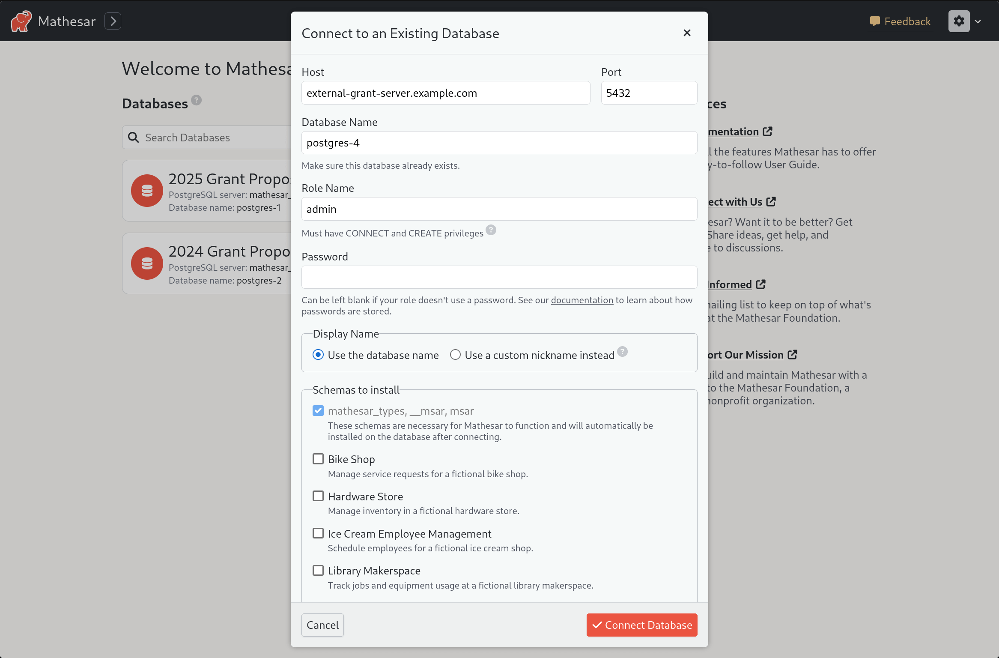

# Mathesar 0.2.1

## Summary

Mathesar 0.2.1 addresses a number of bug fixes identified by members of our community during our **beta** release. This release also includes some quality-of-life improvements to Mathesar like nicknames for databases, persisted column widths, and the ability to connect databases without a password.

We also have a new form to allow users to submit suggestions and feedback about Mathesar to our team.

_This page provides a comprehensive list of all changes since version [0.2.0](./0.2.0.md)._

## Improvements

### Database nicknames

Users can now assign nicknames to their configured databases, making it easier to identify and organize connections. Instead of relying on technical database names, users can set meaningful labels that will be used throughout Mathesar.


This is especially useful when managing multiple databases with identical names, or when connecting to external services where database names are automated.


In addition to nickname support, all database connection values can now be edited.


[#4262](https://github.com/mathesar-foundation/mathesar/pull/4262 "Frontend support for databases nicknames")
[#4244](https://github.com/mathesar-foundation/mathesar/pull/4244 "Backend support for database nicknames")
[#4261](https://github.com/mathesar-foundation/mathesar/pull/4261 "Allow DB name/host/port to be updated")

### In-app feedback

Users can now provide direct feedback within the app using a built-in feedback form. This simple  input allows users to share thoughts, report issues, or suggest improvements without leaving the interface.


[#4241](https://github.com/mathesar-foundation/mathesar/pull/4241 "Move feedback to app header, add mailing list link to home page")

### Column widths are persisted

Column widths in table views are now automatically saved, ensuring a consistent layout across sessions. Users no longer need to manually adjust column sizes every time they revisit a table, improving usability and efficiency when working with columns of varied lengths.


[#4257](https://github.com/mathesar-foundation/mathesar/pull/4257 "Persist column width")
[#4248](https://github.com/mathesar-foundation/mathesar/pull/4248 "Backend support to persist customized column widths")

### Drop schema contents when deleting

Mathesar now automatically drops all objects within a schema before deleting the schema itself, without relying on CASCADE. This ensures a safer and more controlled deletion process, preventing unintended removal of external dependencies while still allowing users to delete schemas that contain objects.


This strikes a unique balance between safety and convenience, making it easier to manage schemas while reducing the risk of accidental data loss. It also provides greater confidence when granting database access to users, as deletions remain contained and predictable.

[#4251](https://github.com/mathesar-foundation/mathesar/pull/4251 "Drop schema contents when deleting")

### Docker Compose installs are updated to Postgres 17

!!! info "For existing users"

    See the [upgrading Postgres](#upgrading-postgres) section for instructions on safely upgrading your Postgres version.

  New installs of Mathesar using our recommended [Docker Compose](../administration/install-via-docker-compose.md) installation will now use Postgres 17. Prior to 1.2.1, Mathesar installs configured via our docker compose file used version 13.


[#4263](https://github.com/mathesar-foundation/mathesar/pull/4263 "Upgrade docker compose to PG 17")

### Support connections without a database password

Mathesar now allows users to configure database connections without requiring a password. This provides greater flexibility for users relying on secure, passwordless authentication mechanisms while maintaining compatibility with a variety of database configurations.



[#4252](https://github.com/mathesar-foundation/mathesar/pull/4252 "Partially support passwordless Database Roles")
[#4255](https://github.com/mathesar-foundation/mathesar/pull/4255 "Copy suggestions for passwordless roles in Mathesar")

### Additional features

- Backend changes to support CSV file imports with an id column [#4269](https://github.com/mathesar-foundation/mathesar/pull/4269 "Backend changes to support CSV file imports with an id column")
- Allow patching records in tables with non-integer primary keys [#4246](https://github.com/mathesar-foundation/mathesar/pull/4246 "Allow patching records in tables with non-integer primary keys")

## Bug fixes

- Fix UnicodeEncodeError during connection attempt [#4254](https://github.com/mathesar-foundation/mathesar/pull/4254 "Use binary reads and writes whenever possible") [#4272](https://github.com/mathesar-foundation/mathesar/pull/4272 "Revert read mode in mathesar_ui")
- Remove unnecessary loading spinner from table widget during refresh [#4222](https://github.com/mathesar-foundation/mathesar/pull/4222 "introduce the showLoadingSpinner prop in TableView.svelte")

## Documentation

- Update documentation styling [#4227](https://github.com/mathesar-foundation/mathesar/pull/4227 "Update documentation styling")
- README improvements [#4208](https://github.com/mathesar-foundation/mathesar/pull/4208 "Changes to README") [#4212](https://github.com/mathesar-foundation/mathesar/pull/4212 "Update README messaging.") [#4184](https://github.com/mathesar-foundation/mathesar/pull/4184 "Remove demo reference from README")
- Documentation cleanup [#4205](https://github.com/mathesar-foundation/mathesar/pull/4205 "Fixed docs nav capitalization inconsistencies") [#4201](https://github.com/mathesar-foundation/mathesar/pull/4201 "Use relative URLs for screenshots")  [#4203](https://github.com/mathesar-foundation/mathesar/pull/4203 "Fix video URLs")
- Small docs improvement to collaborators [#4225](https://github.com/mathesar-foundation/mathesar/pull/4225 "Small docs improvement to collaborators")
- Updated Mathesar description to align with messaging. [#4213](https://github.com/mathesar-foundation/mathesar/pull/4213 "Updated Mathesar description to align with messaging.")
- Add simple analytics to docs [#4217](https://github.com/mathesar-foundation/mathesar/pull/4217 "Add simple analytics to docs")

## Maintenance

The following PRs represent work done to reduce technical debt, update dependencies, improve developer documentation, and maintain our workflows.

[#4259](https://github.com/mathesar-foundation/mathesar/pull/4259 "Remove dead sql v0.2.1")
[#4266](https://github.com/mathesar-foundation/mathesar/pull/4266 "Remove unused SQL")
[#4265](https://github.com/mathesar-foundation/mathesar/pull/4265 "Make Docker Image debuggable")
[#4230](https://github.com/mathesar-foundation/mathesar/pull/4230 "Issue4190 /Removed JSON import from UI")
[#4146](https://github.com/mathesar-foundation/mathesar/pull/4146 "Bump django from 4.2.17 to 4.2.18")
[#4253](https://github.com/mathesar-foundation/mathesar/pull/4253 "Remove unused demo telemetry code")
[#4209](https://github.com/mathesar-foundation/mathesar/pull/4209 "Fix bug in RichText parsing")

## Upgrading to Postgres 17 {:#upgrading-postgres}

Follow these steps to upgrade Postgres to the latest version. Note that this upgrade is only necessary for existing Mathesar users who would like to switch to the latest version of Postgres.

1. Navigate to your installation directory.
2. Shut down Mathesar with `docker compose down`.
3. Create a backup of your installation with `cp -r msar msar.backup`. Keep the `msar.backup` folder in a safe location.
4. Back up your existing Docker Compose configuration with `cp docker-compose.yml docker-compose.yml.backup`.
5. Download the latest Docker Compose file with:
   ```
   wget https://github.com/mathesar-foundation/mathesar/raw/0.2.1/docker-compose.yml
   ```
6. Edit the new `docker-compose.yml` file to restore any personal variables or custom configurations from your backup.
7. Restart Mathesar with the latest images:
   ```
   docker compose up --pull always -d
   ```
8. Once you've confirmed everything is working correctly, you can delete the backup files.

### Troubleshooting & rolling back

If you encounter issues or the upgrade fails:

1. Restore the previous `docker-compose.yml`:
   ```
   mv docker-compose.yml.backup docker-compose.yml
   ```
2. Restore your Mathesar installation:
   ```
   rm -rf msar && mv msar.backup msar
   ```
3. Start Mathesar again:
   ```
   docker compose up -d
   ```

For additional support, reach out to the Mathesar team via a [GitHub issue](https://github.com/mathesar-foundation/mathesar/issues/new/choose) or in the general channel of our [Matrix chat](https://wiki.mathesar.org/en/community/matrix).

## Upgrading to 0.2.1  {:#upgrading}

### For installations using Docker Compose

If you have a Docker compose installation (including one from the guided script), run the command below:

```
docker compose -f /etc/mathesar/docker-compose.yml up --pull always -d
```

!!! warning "Your installation directory may be different"
    You may need to change `/etc/mathesar/` in the command above if you chose to install Mathesar to a different directory.

### For installations done from scratch

If you installed Mathesar [from scratch](../administration/install-from-scratch.md), then use these steps to upgrade your installation to 0.2.1.

1. Go to your Mathesar installation directory

    ```
    cd xMATHESAR_INSTALLATION_DIRx
    ```

    !!! note
        Your installation directory may be different from above if you used a different directory when installing Mathesar.

1. Pull version 0.2.1 from the repository

    ```
    git pull https://github.com/mathesar-foundation/mathesar.git
    git checkout 0.2.1
    ```

1. Update Python dependencies

    ```
    pip install -r requirements-prod.txt
    ```

1. Activate our virtual environment

    ```
    source ./mathesar-venv/bin/activate
    ```

2. Run Django migrations

    ```
    python manage.py migrate
    ```

3. Download and extract frontend assets

    ```
    wget https://github.com/mathesar-foundation/mathesar/releases/download/0.2.1/static_files.zip
    unzip static_files.zip && mv static_files mathesar/static/mathesar && rm static_files.zip
    ```

4. Compile Mathesar translation files

    ```
    python manage.py compilemessages
    ```

5. Update Mathesar functions on the database:

    ```
    python -m mathesar.install --skip-confirm | tee /tmp/install.py.log
    ```

6. Restart the gunicorn server

    ```
    systemctl restart gunicorn
    ```
