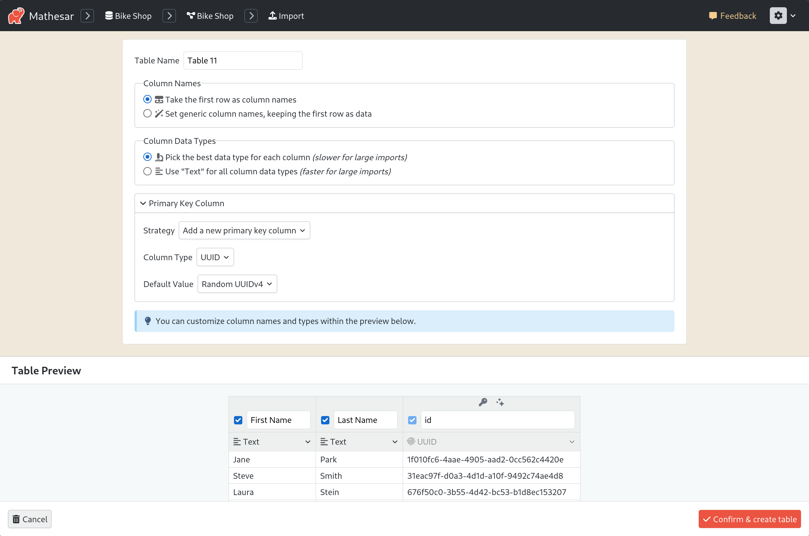
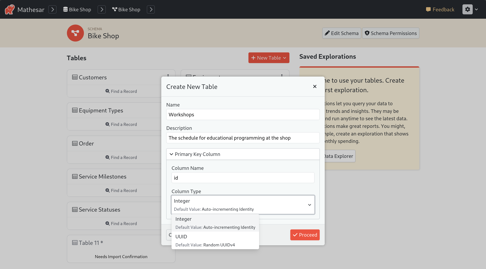
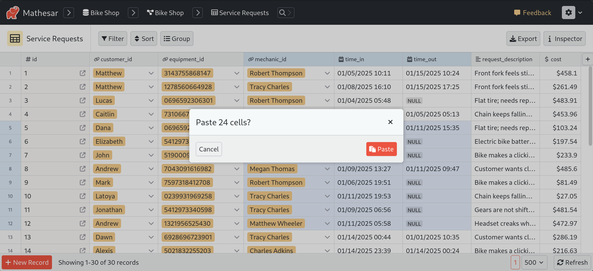
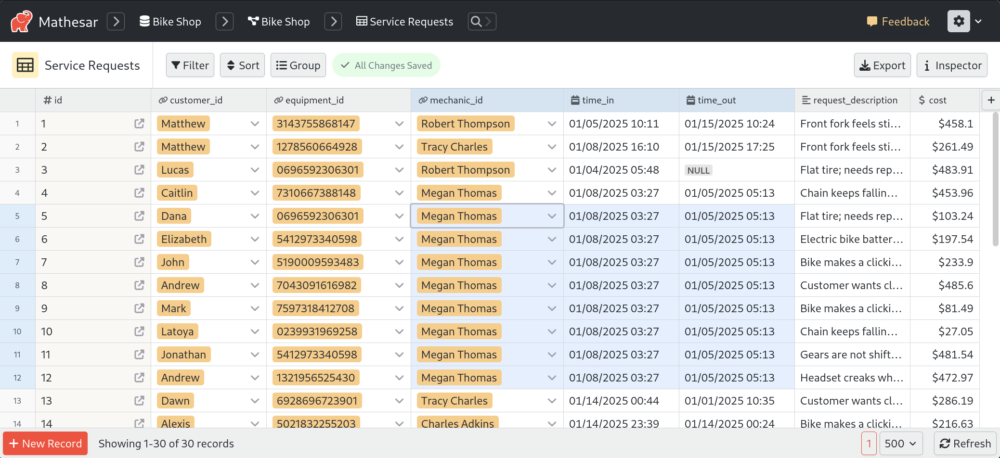

# Mathesar 0.2.2

???+ note "Help shape the future of Mathesar"
    We're looking to speak with users to better understand how Mathesar can help you or your team. It's only a 20 minute interview, and we're happy to offer a $25 gift card in return.

    If you're interested in helping, you can use [this link](https://cal.com/mathesar/users) to schedule a chat with Zack on the Mathesar team. Thank you!

## Summary

Mathesar 0.2.2 brings key improvements, including enhanced primary key handling, smart pasting for easier data entry, and various bug fixes. Users can now choose UUIDs as primary keys, designate any existing column as a primary key during data import, and benefit from a new UUID column type.

_This page provides a comprehensive list of all changes in the release._

## Improvements

### Enhanced primary key handling

Mathesar 0.2.2 introduces several improvements to working with primary keys, including support for UUIDs as primary keys. We've also added a dedicated UUID column type, making it easier to work with UUIDs in any column—not just primary keys.

#### Improvements when importing data

When importing existing data, Mathesar automatically generates a primary key column if one isn’t provided. Previously, importing a simple CSV like:

```csv
First Name,Last Name
Jane,Park
Steve,Smith
Laura,Stein
Amy,Richards
```

would result in Mathesar automatically adding an integer primary key column that auto-increments by default.

That's still the default behavior. But now, you can choose the type of generated primary key column: either an auto-incrementing integer _or_ a UUID column with a default value of a random UUIDv4:



Additionally, you can now designate _any_ existing column as the primary key. If you select a UUID or Number column, you’ll have the option to apply the same default value settings that Mathesar uses for generated primary key columns.

#### Improvements to creating tables

When creating new tables in Mathesar, you'll now have the option to set the name and type of your primary key column:



As when importing data, you can choose between an auto-incrementing integer _or_ a UUID column with a default value of a random UUIDv4.

#### Improvements to tables without primary keys

Previously, Mathesar would display all kinds of errors when viewing and attempting to edit records in tables without primary keys. Now, we've made the limitations of working with tables without primary keys in Mathesar much clearer:

- Cell editing is disabled
- The placeholder row and 'Add new record' button is hidden.
- We display an attention indicator with a tooltip that mentions that row level operations are not supported.

[#4337](https://github.com/mathesar-foundation/mathesar/pull/4337 "Refactor records store to improve readability") [#4331](https://github.com/mathesar-foundation/mathesar/pull/4331 "Backend functions to modify table primary keys") [#4353](https://github.com/mathesar-foundation/mathesar/pull/4353 "Implement PK config for CSV imports") [#4348](https://github.com/mathesar-foundation/mathesar/pull/4348 "Allow editing PK cell when inserting rows, when PK column does not have a dynamic default set") [#4358](https://github.com/mathesar-foundation/mathesar/pull/4358 "Fix no-header import bug") [#4349](https://github.com/mathesar-foundation/mathesar/pull/4349 "Improve experience for tables without primary keys") [#4366](https://github.com/mathesar-foundation/mathesar/pull/4366 "Make identity setting declarative in `data_modeling.set_primary_key_column`") [#4316](https://github.com/mathesar-foundation/mathesar/pull/4316 "Simplify CSV wrangling logic when importing data") [#4320](https://github.com/mathesar-foundation/mathesar/pull/4320 "Implement UUID type on front end") [#4329](https://github.com/mathesar-foundation/mathesar/pull/4329 "support uuid casts and inference") [#4321](https://github.com/mathesar-foundation/mathesar/pull/4321 "Skip PK column in records.patch from record page") [#4359](https://github.com/mathesar-foundation/mathesar/pull/4359 "Make recovery easier during failed import, show proper errors during header change failure")


### Smart pasting to and from cells

Mathesar now supports smart pasting, making it easy to update multiple cells across rows in one go. Mathesar automatically handles type conversions, so you can paste data from different formats without hassle. Linked column references work just like any other value.

After selecting and copying cells, highlight the cells to paste into and press your system's keyboard shortcut (`Command+V`/`⌘+V` on macOS, and `Ctrl+V` on Windows and Linux).

You'll see a conformation dialog:



After choosing "paste", your selected rows will be updated with the new values.



[#4258](https://github.com/mathesar-foundation/mathesar/pull/4258 "Support pasting data into cells from system clipboard") [#4322](https://github.com/mathesar-foundation/mathesar/pull/4322 "Allow pasting empty strings in NOT NULL columns") [#4327](https://github.com/mathesar-foundation/mathesar/pull/4327 "Add PK control to New Table form") [#4326](https://github.com/mathesar-foundation/mathesar/pull/4326 "Define pkey during table.add")
[#4345](https://github.com/mathesar-foundation/mathesar/pull/4345 "Fix bug when pasting into cell  n edit mode")


### Additional improvements

- Nickname searching in database search [#4354](https://github.com/mathesar-foundation/mathesar/pull/4354 "Adding nickname searching in database search")
- Set default time type to 'Time without Time Zone' in new column form [#4346](https://github.com/mathesar-foundation/mathesar/pull/4346 "Set default time type to 'Time without Time Zone' in new column form")

## Bug fixes

- Fix UUID search [#4351](https://github.com/mathesar-foundation/mathesar/pull/4351 "Fix UUID search")
- Revert custom line-height on Dropdown [#4344](https://github.com/mathesar-foundation/mathesar/pull/4344 "Revert custom line-height on Dropdown")
- Remove mathesar_money from type inference [#4350](https://github.com/mathesar-foundation/mathesar/pull/4350 "Remove mathesar_money from type inference")
- Fix documentation version chooser [#4291](https://github.com/mathesar-foundation/mathesar/pull/4291 "Fix documentation version chooser")
- Make SQL tests fail when test file is broken [#4293](https://github.com/mathesar-foundation/mathesar/pull/4293 "Make SQL tests fail when test file is broken")
- Fix problem with timezones and date/time keywords [#4317](https://github.com/mathesar-foundation/mathesar/pull/4317 "Fix problem with timezones and date/time keywords")
- Invalid uri empty page [#4365](https://github.com/mathesar-foundation/mathesar/pull/4365 "4187 invalid uri empty page")

## Documentation

- Fix search result styling [#4287](https://github.com/mathesar-foundation/mathesar/pull/4287 "Fix search result styling")
- Update README.md to fix typo [#4361](https://github.com/mathesar-foundation/mathesar/pull/4361 "Update README.md to fix typo")

## Maintenance

- Revert "Bump django from 4.2.18 to 4.2.20" [#4325](https://github.com/mathesar-foundation/mathesar/pull/4325 "Revert Bump django from 4.2.18 to 4.2.20")
- Bump django from 4.2.18 to 4.2.20 [#4315](https://github.com/mathesar-foundation/mathesar/pull/4315 "Bump django from 4.2.18 to 4.2.20")


## Upgrading to 0.2.2  {:#upgrading}

### For installations using Docker Compose

If you have a Docker compose installation (including one from the guided script), run the command below:

```
docker compose -f /etc/mathesar/docker-compose.yml up --pull always -d
```

!!! warning "Your installation directory may be different"
    You may need to change `/etc/mathesar/` in the command above if you chose to install Mathesar to a different directory.

### For installations done from scratch

If you installed Mathesar [from scratch](../administration/install-from-scratch.md), then use these steps to upgrade your installation to 0.2.2.

1. Go to your Mathesar installation directory

    ```
    cd xMATHESAR_INSTALLATION_DIRx
    ```

    !!! note
        Your installation directory may be different from above if you used a different directory when installing Mathesar.

1. Pull version 0.2.2 from the repository

    ```
    git pull https://github.com/mathesar-foundation/mathesar.git
    git checkout 0.2.2
    ```

1. Update Python dependencies

    ```
    pip install -r requirements.txt
    ```

1. Activate our virtual environment

    ```
    source ./mathesar-venv/bin/activate
    ```

2. Run Django migrations

    ```
    python manage.py migrate
    ```

3. Download and extract frontend assets

    ```
    wget https://github.com/mathesar-foundation/mathesar/releases/download/0.2.2/static_files.zip
    unzip static_files.zip && mv static_files mathesar/static/mathesar && rm static_files.zip
    ```

4. Compile Mathesar translation files

    ```
    python manage.py compilemessages
    ```

5. Update Mathesar functions on the database:

    ```
    python -m mathesar.install --skip-confirm | tee /tmp/install.py.log
    ```

6. Restart the gunicorn server

    ```
    systemctl restart gunicorn
    ```
