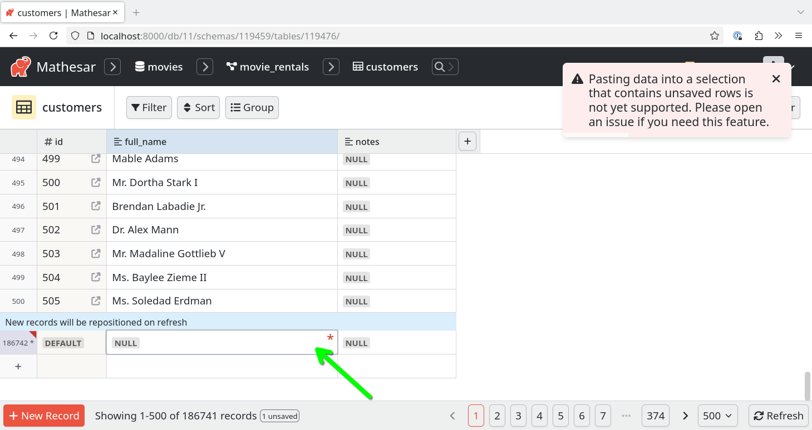

# Mathesar 0.2.3

???+ warning "Switch to 0.2.5 if connecting over Unix socket"
    If you plan to connect Postgres databases to Mathesar over a Unix socket, we _strongly_ recommend upgrading to version [0.2.5](./0.2.5.md). Unix socket connections were introduced in 0.2.3 but contained a number of bugs related to port specification and the creation of new databases.

## Summary

Mathesar 0.2.3 adds support for row duplication, enhanced paste behavior in newly saved rows, new ways to connect an internal database, and improved numeric inference.

!!! info ""
	This page provides a comprehensive list of all changes in the release.

## Improvements
<!-- (Each feature within this section should have its own level-three heading) -->

### More options for internal database connections

Mathesar now supports connecting to internal PostgreSQL databases using any valid connection string, including configurations that:

- Use Unix sockets instead of TCP/IP.
- Omit the port or do not require a password.

Previously, Mathesar required both a port and password to be defined, which prevented these types of connections. This was a common pain point for users attempting to use custom Postgres installations.

Here's an example of the `docker-compose.yml` configuration to connect to Postgres running on the UNIX socket:

```yml
POSTGRES_HOST="%2Fvar%2Frun%2Fpostgresql"
POSTGRES_PORT=""
POSTGRES_USER="mathesar"
POSTGRES_PASSWORD=""
POSTGRES_DB="mathesar_django"
```

!!! tip "Tip"
    `%2F` is the URL-encoded version of `/`, which is required when specifying a Unix socket path in a PostgreSQL connection string.

[#4416](https://github.com/mathesar-foundation/mathesar/pull/4416 "Make password and port optional for django db connection string")

### "Duplicate row" functionality

It's now easy to duplicate rows in Mathesar using the "right click" context menu. Right click any cell in the row you would like to duplicate and choose "Duplicate Record".

[#4414](https://github.com/mathesar-foundation/mathesar/pull/4414 "Implement context menu to duplicate records")

### Support for pasting into cells of newly-inserted rows

You may now paste data into the cells of newly-saved rows. Previously, you needed to hit the "refresh" button or reload the page before pasting into these rows.

It is still not possible to paste into new, _unsaved_ rows. Attempting to do so will present an error:



[#4410](https://github.com/mathesar-foundation/mathesar/pull/4410 "Support pasting into new PersistedRecordRow cells")

<!-- ## Groundwork -->
<!-- (Use this section to list any incremental work done on still-incomplete changes) -->

### Improved inference for numeric columns

In this release we have greatly improved the accuracy, safety, and performance of type inference for numeric columns. This means that Mathesar is much faster and reliable at detecting the type of numeric columns.

In the future, this will enable significant front end performance improvements when switching columns to and from numeric types.

[#4406](https://github.com/mathesar-foundation/mathesar/pull/4406 "Improve inference for numeric columns")

<!-- ## Bug fixes -->


## Documentation

- Fix pencil "edit" icons to be clickable [#4369](https://github.com/mathesar-foundation/mathesar/pull/4369 "[Docs] Fix pencil edit icons to be clickable")

## Maintenance

### Removed redundant casting functions

Many of Mathesar's existing casting functions included multiple versions that accepted different types of parameters. Where possible, we are making an effort to simplify and remove these redundant functions.

[#4386](https://github.com/mathesar-foundation/mathesar/pull/4386 "Remove redundant cast_to_numeric functions ") [#4387](https://github.com/mathesar-foundation/mathesar/pull/4387 "Remove redundant cast_to_mathesar_money functions") [#4389](https://github.com/mathesar-foundation/mathesar/pull/4389 "Remove redundant cast_to_money functions") [#4390](https://github.com/mathesar-foundation/mathesar/pull/4390 "Remove redundant cast_to_boolean functions") [#4391](https://github.com/mathesar-foundation/mathesar/pull/4391 "Remove redundant cast_to_multicurrency_money functions") [#4392](https://github.com/mathesar-foundation/mathesar/pull/4392 "Remove redundant cast_to_real functions") [#4393](https://github.com/mathesar-foundation/mathesar/pull/4393 "Remove redundant cast_to integer and interval functions") [#4394](https://github.com/mathesar-foundation/mathesar/pull/4394 "Remove redundant cast_to smallint and bigint functions") [#4395](https://github.com/mathesar-foundation/mathesar/pull/4395 "Remove redundant cast_to double precision and email functions") [#4396](https://github.com/mathesar-foundation/mathesar/pull/4396 "Remove redundant cast to date and time functions") [#4397](https://github.com/mathesar-foundation/mathesar/pull/4397 "Remove redundant cast to varchar, char, text & uri functions") [#4398](https://github.com/mathesar-foundation/mathesar/pull/4398 "Remove redundant cast_to json like functions") [#4401](https://github.com/mathesar-foundation/mathesar/pull/4401 "Revert Remove redundant cast to varchar, char, text & uri functions") [#4402](https://github.com/mathesar-foundation/mathesar/pull/4402 "Remove redundant cast to varchar, char, text & uri functions + fix tests") [#4411](https://github.com/mathesar-foundation/mathesar/pull/4411 "fix matrix_tests")

### Type casting improvements

- Extract casting logic from inference function [#4385](https://github.com/mathesar-foundation/mathesar/pull/4385 "Extract casting logic from inference function")
- Remove valid_target_types [#4404](https://github.com/mathesar-foundation/mathesar/pull/4404 "Remove valid_target_types")
- Make cast_to_uuid sql immutable [#4403](https://github.com/mathesar-foundation/mathesar/pull/4403 "Make cast_to_uuid sql immutable")

### Other maintenance

- Add build tests to checkpoint v2 [#4413](https://github.com/mathesar-foundation/mathesar/pull/4413 "Add build tests to checkpoint v2")
- Bump tj-actions/changed-files from 41 to 46 in /.github/workflows [#4377](https://github.com/mathesar-foundation/mathesar/pull/4377 "Bump tj-actions/changed-files from 41 to 46 in /.github/workflows")
- Update Flake8 to 7.2.0, fix error in deprecated code [#4383](https://github.com/mathesar-foundation/mathesar/pull/4383 "Update Flake8 to 7.2.0, fix error in deprecated code")


## Upgrading to 0.2.3  {:#upgrading}

### For installations using Docker Compose

If you have a Docker compose installation (including one from the guided script), run the command below:

```
docker compose -f /etc/mathesar/docker-compose.yml up --pull always -d
```

!!! warning "Your installation directory may be different"
    You may need to change `/etc/mathesar/` in the command above if you chose to install Mathesar to a different directory.

### For installations done from scratch

If you installed Mathesar [from scratch](../administration/install-from-scratch.md), then use these steps to upgrade your installation to 0.2.3.

1. Go to your Mathesar installation directory

    ```
    cd xMATHESAR_INSTALLATION_DIRx
    ```

    !!! note
        Your installation directory may be different from above if you used a different directory when installing Mathesar.

1. Pull version 0.2.3 from the repository

    ```
    git pull https://github.com/mathesar-foundation/mathesar.git
    git checkout 0.2.3
    ```

1. Update Python dependencies

    ```
    pip install -r requirements.txt
    ```

1. Activate our virtual environment

    ```
    source ./mathesar-venv/bin/activate
    ```

2. Run Django migrations

    ```
    python manage.py migrate
    ```

3. Download and extract frontend assets

    ```
    wget https://github.com/mathesar-foundation/mathesar/releases/download/0.2.3/static_files.zip
    unzip static_files.zip && mv static_files mathesar/static/mathesar && rm static_files.zip
    ```

4. Compile Mathesar translation files

    ```
    python manage.py compilemessages
    ```

5. Update Mathesar functions on the database:

    ```
    python -m mathesar.install --skip-confirm | tee /tmp/install.py.log
    ```

6. Restart the gunicorn server

    ```
    systemctl restart gunicorn
    ```
