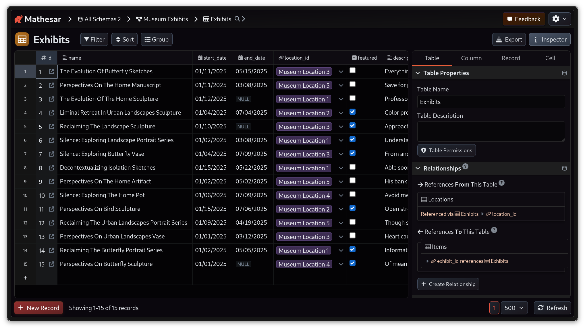
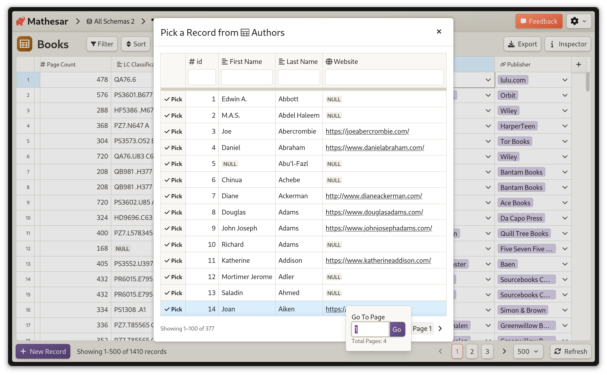

# Mathesar 0.3.0

## Summary

Mathesar 0.3.0 focuses on improvements to Mathesar's installation experience, look-and-feel, usability, and stability. Highlights include a new dark mode theme, a UI refresh in light mode and a new install method using a one-line script. We've also improved usability of the Data Explorer, finding table records, and creating records. The release includes several other smaller fixes and improvements.

!!! info ""
	This page provides a comprehensive list of all changes in the release.

## Improvements

### A new look for Mathesar

We've updated Mathesar's visual style to improve readability and contrast, move towards design consistency, support future ability to theme Mathesar, and better integrate with the new [https://mathesar.org/](https://mathesar.org/).


/// caption
A preview of the table page in Mathesar's new Light theme
///

As part of our new look, we've also introduced a dark mode theme for users who prefer using dark backgrounds to reduce eye strain for extended use.


/// caption
A preview of the table page in Mathesar's new Dark theme
///

By default, Mathesar will respect your "system" color theme. You can switch to explicitly using light or dark mode via a new toggle in the header menu:


*Related work:* [#4380](https://github.com/mathesar-foundation/mathesar/pull/4380 "UI redesign and dark mode") [#4483](https://github.com/mathesar-foundation/mathesar/pull/4483 "Update color variables and components") [#4439](https://github.com/mathesar-foundation/mathesar/pull/4439 "Improve CSS sizing variable names") [#4407](https://github.com/mathesar-foundation/mathesar/pull/4407 "Dark Mode toggle") [#4477](https://github.com/mathesar-foundation/mathesar/pull/4477 "Fix general padding and schema card styles") [#4442](https://github.com/mathesar-foundation/mathesar/pull/4442 "Fix broken template tags in complete_installation Django template")

### Updated "from scratch" installation workflow

We've streamlined Mathesar's "from scratch" installation using [`uv`](https://docs.astral.sh/uv/), which eliminates several steps from the process. This simplifies setup for users who want to use Mathesar without Docker. You can see the updated installation instructions [here](../administration/install-from-scratch.md).

*Related work:*
[#4399](https://github.com/mathesar-foundation/mathesar/pull/4399 "Scripts to package, install, upgrade, run Mathesar")
[#4533](https://github.com/mathesar-foundation/mathesar/pull/4533 "Fix install script to accept unix domain socket based connections") [#4503](https://github.com/mathesar-foundation/mathesar/pull/4503 "Use kwargs for creating psycopg connections") [#4508](https://github.com/mathesar-foundation/mathesar/pull/4508 "Decouple .env file and Caddyfile, improve deployment instructions") [#4540](https://github.com/mathesar-foundation/mathesar/pull/4540 "Prompt user when connection string is provided and env file has connection parameters") [#4448](https://github.com/mathesar-foundation/mathesar/pull/4448 "Update command in developer guide to start dev-service")

### Browsing records in the record selector

Previously, Mathesar's "record selector" only displayed the first 10 rows of a table, and relied primarily on the search interface. We now support pagination and displaying up to 100 rows per page, which makes it much easier to browse all available records.



[#4534](https://github.com/mathesar-foundation/mathesar/pull/4534 "Add pagination to record selector")

### Data Explorer usability improvements

We've eliminated the distinction between viewing and editing explorations, instead moving to a single page that allows you to do both. We also now save column width changes made while viewing explorations.

We've made a few other minor usability improvements such as improving headings, using a dynamic "Inspector" button that indicates when the inspector is open, improved display of help text.

We have also removed "undo" / "redo" functionality within the data explorer to prepare for future improvements.

*Related work:*  [#4453](https://github.com/mathesar-foundation/mathesar/pull/4453 "Persist custom column widths in explorations")
[#4440](https://github.com/mathesar-foundation/mathesar/pull/4440 "Small data explorer UI adjustments")
[#4446](https://github.com/mathesar-foundation/mathesar/pull/4446 "Simplify data explorer")
[#4460](https://github.com/mathesar-foundation/mathesar/pull/4460 "Add primary key flag to exploration column metadata")

### Pasting into Mathesar now works with draft rows

Previously, pasting into Mathesar tables only worked for rows that had already been saved to PostgreSQL. Now you can create draft rows and paste into them.

*Related work:* [#4505](https://github.com/mathesar-foundation/mathesar/pull/4505 "Allow pasting data into draft record rows")

### Set up security policy

We've added an initial security policy for Mathesar in line with best practices from other open source projects. Our aim was to use GitHub security features and improve our workflow around users reporting potential vulnerabilities.

*Related work:*  [#4548](https://github.com/mathesar-foundation/mathesar/pull/4548 "Add initial security policy")

### New help text for time zone DB option

We've improved our in-app explanation of how Postgres `WITH TIME ZONE` behavior works for users who may not be familiar with it.

*Related work:* [#4476](https://github.com/mathesar-foundation/mathesar/pull/4476 "Add support for user helper info text in form inputs")

## Bug Fixes

- Fix issue where `NOT NULL` constraints could only be set in the `public` schema [#4531](https://github.com/mathesar-foundation/mathesar/pull/4531 "Fix not null SQL")
- Fix localization not being available during Mathesar setup [#4449](https://github.com/mathesar-foundation/mathesar/pull/4449 "Add language selector to complete installation template")
- Fix issue with some external links not showing the external link icon [#4450](https://github.com/mathesar-foundation/mathesar/pull/4450 "Always display external links icon in the DocsLink component")
- Fix UUID-based foreign keys showing the value directly in filters instead of showing the record selector [#4491](https://github.com/mathesar-foundation/mathesar/pull/4491 "Use the record selector when filtering a UUID FK column")
- Fix issue where a text data type column could not be changed to money data type [#4415](https://github.com/mathesar-foundation/mathesar/pull/4415 "Fix cast_to_mathesar_money")

## Maintenance

- Lay the groundwork for the refactor of altering database columns [#4499](https://github.com/mathesar-foundation/mathesar/pull/4499 "Alter column refactor part 1")
- Frontend preparation work for future backend casting performance improvements [#4426](https://github.com/mathesar-foundation/mathesar/pull/4426 "Pass casting options when importing")
- Work related to our internal workflows [#4438](https://github.com/mathesar-foundation/mathesar/pull/4438 "Merge 0.2.3 release back into develop") [#4444](https://github.com/mathesar-foundation/mathesar/pull/4444 "Clean up front end linting warnings") [#4447](https://github.com/mathesar-foundation/mathesar/pull/4447 "Add pull_policy to dev docker service") [#4451](https://github.com/mathesar-foundation/mathesar/pull/4451 "Bump django from 4.2.18 to 4.2.21") [#4452](https://github.com/mathesar-foundation/mathesar/pull/4452 "Fix CI") [#4471](https://github.com/mathesar-foundation/mathesar/pull/4471 "cache on push to develop") [#4472](https://github.com/mathesar-foundation/mathesar/pull/4472 "fix indentation") [#4478](https://github.com/mathesar-foundation/mathesar/pull/4478 "Use docker pull before docker compose in CI") [#4487](https://github.com/mathesar-foundation/mathesar/pull/4487 "Merge master into develop") [#4497](https://github.com/mathesar-foundation/mathesar/pull/4497 "Merge master into develop correctly") [#4498](https://github.com/mathesar-foundation/mathesar/pull/4498 "Merge master into develop clean")  [#4537](https://github.com/mathesar-foundation/mathesar/pull/4537 "Bump django from 4.2.21 to 4.2.22") [#4539](https://github.com/mathesar-foundation/mathesar/pull/4539 "Bump requests from 2.32.3 to 2.32.4")

## Upgrading to 0.3.0  {:#upgrading}

### For installations using Docker Compose

If you have a Docker compose installation, run the command below:

```
docker compose -f /etc/mathesar/docker-compose.yml up --pull always -d
```

!!! warning "Your installation directory may be different"
    You may need to change `/etc/mathesar/` in the command above if you chose to install Mathesar to a different directory.

### For direct installations of Mathesar on Linux, macOS, or WSL

Starting with Mathesar 0.3.0, we provide an install script that automates both fresh installs and upgrades for standalone (non-Docker) installations.

!!! tip "Previously referred to as "Installation from scratch""
    In versions earlier than 0.3.0, this setup was referred to as "Installation from scratch"

Follow the steps below to upgrade Mathesar:


1. Enter your installation directory into the box below and press <kbd>Enter</kbd> to personalize this guide:

    <input data-input-for="MATHESAR_INSTALL_DIR" aria-label="Your Mathesar installation directory"/>

    - Do _not_ include a trailing slash.
    - Do _not_ use any variables like `$HOME`.

1.  Go to your Mathesar installation directory.

    ```
    cd xMATHESAR_INSTALL_DIRx
    ```

    !!! note
        Your installation directory may be different from above if you used a different directory when installing Mathesar.

1. Download and run the install script for 0.3.0

    ```
    curl -sSfL https://github.com/mathesar-foundation/mathesar/releases/download/0.3.0/install.sh -o install.sh
    chmod +x install.sh

    ./install.sh .
    ```

1. Replace your gunicorn systemd service with a Mathesar systemd service

    1. Disable and stop the existing gunicorn service
        ```
        systemctl disable gunicorn.service
        systemctl stop gunicorn.service
        ```

    2. Follow the steps in [Run Mathesar as a systemd service](../administration/install-from-scratch.md#run-mathesar-as-a-systemd-service) from the installation guide

    3. Remove the gunicorn service file
        ```
        sudo rm /lib/systemd/system/gunicorn.service
        ```

1. Update your Caddyfile

    1. Use the configuration shown in [Install and configure Caddy](.md#install-and-configure-caddy) in the installation guide, and update your Caddyfile accordingly

    2. Ensure that your domains are specified directly in the first line of the Caddyfile

    3. Restart your Caddy service
      ```
      systemctl restart caddy.service
      ```

!!! tip
    **If you're running Mathesar only on localhost and do not want it to run as a service**, you could:

    1. Remove the gunicorn and caddy services
    1. Start Mathesar manually with:
      ```
      mathesar run
      ```
