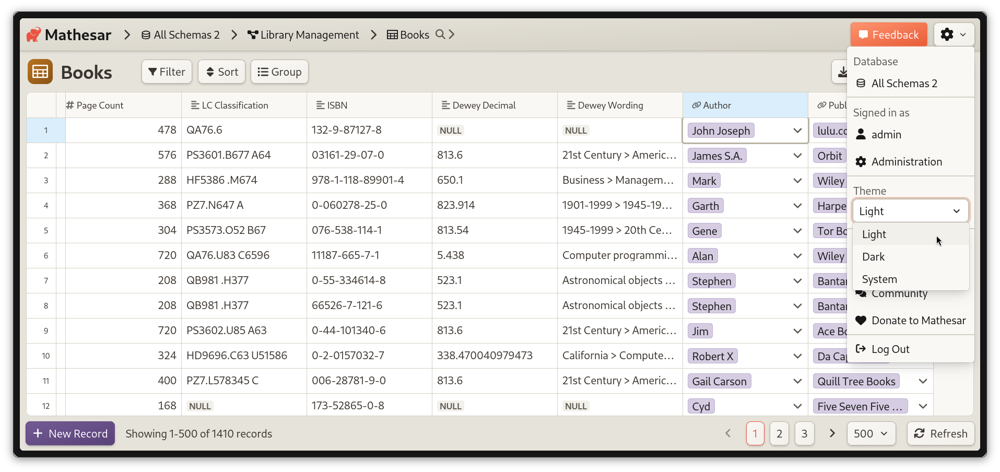

# Mathesar 0.3.0

???+ note "Help shape the future of Mathesar"
    We're looking to speak with users to better understand how Mathesar can help you or your team. It's only a 20 minute interview, and we're happy to offer a $25 gift card in return.

    If you're interested in helping, you can use [this link](https://cal.com/mathesar/users) to schedule a chat with Zack on the Mathesar team. Thank you!

## Summary

Mathesar 0.3.0 introduces several enhancements aimed at improving user experience, installation simplicity, and overall stability. The user interface has been refreshed with redesigned colors and comprehensive dark mode support. This release also intruduces a streamlined standalone installation method, enabling simpler setup and upgrades without relying on Docker.

The Data Explorer receives notable usability improvements, including persistent column widths and refined UI elements. Additionally, this release adds pagination to the record selector, provides better user guidance for form inputs, and adds a language selection option during installation.

Various bug fixes and  maintenance tasks have also been completed, further enhancing the stability of Mathesar and improving the overall experience.

!!! info ""
	This page provides a comprehensive list of all changes in the release.

## Introducing dark mode and a new look for Mathesar


/// caption
A preview of the table page in Mathesar's new Light theme
///


/// caption
A preview of the table page in Mathesar's new Dark theme
///

Mathesar 0.3.0 debuts an updated visual style and introduces dark mode. The new color scheme improves readability and contrast, making your data easier to manage across different lighting conditions. Dark mode reduces eye strain for comfortable extended use. Refined spacing and consistent design provide a cohesive, streamlined interface.

By default, Mathesar will respect your "system" color theme. You can switch to explicitly using light or dark mode via a new toggle in the header menu:



[#4380](https://github.com/mathesar-foundation/mathesar/pull/4380 "UI redesign and dark mode") [#4483](https://github.com/mathesar-foundation/mathesar/pull/4483 "Update color variables and components") [#4439](https://github.com/mathesar-foundation/mathesar/pull/4439 "Improve CSS sizing variable names") [#4407](https://github.com/mathesar-foundation/mathesar/pull/4407 "Dark Mode toggle") [#4477](https://github.com/mathesar-foundation/mathesar/pull/4477 "Fix general padding and schema card styles") [#4442](https://github.com/mathesar-foundation/mathesar/pull/4442 "Fix broken template tags in complete_installation Django template")

## New Installation Method

This release introduces a new way to install Mathesar directly, replacing the previous "from scratch" installation method. You can see full installation instructions for the new method [here](../administration/install-from-scratch.md). This approach allows for installing Mathesar on Linux, macOS, and Windows (via WSL 2) without depending on Docker or manually installing Mathesar's dependencies.

The bulk of work for the new installation method can be viewed in [#4399](https://github.com/mathesar-foundation/mathesar/pull/4399 "Scripts to package, install, upgrade, run Mathesar"), with supporting changes in the following pull requests:

[#4533](https://github.com/mathesar-foundation/mathesar/pull/4533 "Fix install script to accept unix domain socket based connections") [#4503](https://github.com/mathesar-foundation/mathesar/pull/4503 "Use kwargs for creating psycopg connections") [#4508](https://github.com/mathesar-foundation/mathesar/pull/4508 "Decouple .env file and Caddyfile, improve deployment instructions") [#4540](https://github.com/mathesar-foundation/mathesar/pull/4540 "Prompt user when connection string is provided and env file has connection parameters") [#4448](https://github.com/mathesar-foundation/mathesar/pull/4448 "Update command in developer guide to start dev-service")

## Record selector pagination

Previously, Mathesar’s record selector only displayed the first 10 rows of a table, which made it difficult to find and select records when working with larger datasets. With this update, the record selector now supports pagination and displays up to 100 rows per page. Users can browse through all available records using the pagination controls, making it significantly easier to locate and select the appropriate entry from large record sets.


[#4534](https://github.com/mathesar-foundation/mathesar/pull/4534 "Add pagination to record selector")

## Exploration improvements

This release includes a number of small impovements to Mathesar's data explorer:

- Persist custom column widths in explorations [#4453](https://github.com/mathesar-foundation/mathesar/pull/4453 "Persist custom column widths in explorations")
- Small data explorer UI adjustments [#4440](https://github.com/mathesar-foundation/mathesar/pull/4440 "Small data explorer UI adjustments")
- Simplify data explorer [#4446](https://github.com/mathesar-foundation/mathesar/pull/4446 "Simplify data explorer")
- Add primary key flag to exploration column metadata [#4460](https://github.com/mathesar-foundation/mathesar/pull/4460 "Add primary key flag to exploration column metadata")

## Additional improvements

- Always display external links icon in the DocsLink component [#4450](https://github.com/mathesar-foundation/mathesar/pull/4450 "Always display external links icon in the DocsLink component")
- Allow pasting data into draft record rows [#4505](https://github.com/mathesar-foundation/mathesar/pull/4505 "Allow pasting data into draft record rows")
- Add support for user helper info text in form inputs [#4476](https://github.com/mathesar-foundation/mathesar/pull/4476 "Add support for user helper info text in form inputs")
- Add language selector to complete installation template [#4449](https://github.com/mathesar-foundation/mathesar/pull/4449 "Add language selector to complete installation template")
- Add initial security policy [#4548](https://github.com/mathesar-foundation/mathesar/pull/4548 "Add initial security policy")

## Bug Fixes

- Use the record selector when filtering a UUID FK column [#4491](https://github.com/mathesar-foundation/mathesar/pull/4491 "Use the record selector when filtering a UUID FK column")
- Fix cast_to_mathesar_money [#4415](https://github.com/mathesar-foundation/mathesar/pull/4415 "Fix cast_to_mathesar_money")

## Maintenance

### Type Casting Improvements

- Alter column refactor part 1 [#4499](https://github.com/mathesar-foundation/mathesar/pull/4499 "Alter column refactor part 1")
- Pass casting options when importing [#4426](https://github.com/mathesar-foundation/mathesar/pull/4426 "Pass casting options when importing")

### Other Maintenance

The following PRs represent work done to reduce technical debt, update dependencies, improve developer documentation, and maintain our workflows.

[#4438](https://github.com/mathesar-foundation/mathesar/pull/4438 "Merge 0.2.3 release back into develop") [#4444](https://github.com/mathesar-foundation/mathesar/pull/4444 "Clean up front end linting warnings") [#4447](https://github.com/mathesar-foundation/mathesar/pull/4447 "Add pull_policy to dev docker service") [#4451](https://github.com/mathesar-foundation/mathesar/pull/4451 "Bump django from 4.2.18 to 4.2.21") [#4452](https://github.com/mathesar-foundation/mathesar/pull/4452 "Fix CI") [#4471](https://github.com/mathesar-foundation/mathesar/pull/4471 "cache on push to develop") [#4472](https://github.com/mathesar-foundation/mathesar/pull/4472 "fix indentation") [#4478](https://github.com/mathesar-foundation/mathesar/pull/4478 "Use docker pull before docker compose in CI") [#4487](https://github.com/mathesar-foundation/mathesar/pull/4487 "Merge master into develop") [#4497](https://github.com/mathesar-foundation/mathesar/pull/4497 "Merge master into develop correctly") [#4498](https://github.com/mathesar-foundation/mathesar/pull/4498 "Merge master into develop clean") [#4531](https://github.com/mathesar-foundation/mathesar/pull/4531 "Fix not null SQL") [#4537](https://github.com/mathesar-foundation/mathesar/pull/4537 "Bump django from 4.2.21 to 4.2.22") [#4539](https://github.com/mathesar-foundation/mathesar/pull/4539 "Bump requests from 2.32.3 to 2.32.4")

## Upgrading to 0.3.0  {:#upgrading}

### For installations using Docker Compose

If you have a Docker compose installation, run the command below:

```
docker compose -f /etc/mathesar/docker-compose.yml up --pull always -d
```

!!! warning "Your installation directory may be different"
    You may need to change `/etc/mathesar/` in the command above if you chose to install Mathesar to a different directory.

### For direct installations of Mathesar on Linux, macOS, or WSL

Starting with Mathesar 0.3.0, we provide an install script that automates both fresh installs and upgrades for standalone (non-Docker) installations.

!!! tip "Previously referred to as "Installation from scratch""
    In versions earlier than 0.3.0, this setup was referred to as "Installation from scratch"

Follow the steps below to upgrade Mathesar:

1. Go to your Mathesar installation directory

    ```
    cd xMATHESAR_INSTALL_DIRx
    ```

    !!! note
        Your installation directory may be different from above if you used a different directory when installing Mathesar.

1. Download and run the install script for 0.3.0

    ```
    curl -sSfL https://github.com/mathesar-foundation/mathesar/releases/download/0.3.0/install.sh -o install.sh
    chmod +x install.sh

    ./install.sh .
    ```

1. Replace your gunicorn systemd service with a Mathesar systemd service

    1. Disable and stop the existing gunicorn service
        ```
        systemctl disable gunicorn.service
        systemctl stop gunicorn.service
        ```

    2. Follow the steps in [Run Mathesar as a systemd service](../administration/install-from-scratch.md#run-mathesar-as-a-systemd-service) from the installation guide

    3. Remove the gunicorn service file
        ```
        sudo rm /lib/systemd/system/gunicorn.service
        ```

1. Update your Caddyfile

    1. Use the configuration shown in [Install and configure Caddy](../administration/install-from-scratch.md/##install-and-configure-caddy) in the installation guide, and update your Caddyfile accordingly

    1. Ensure that your domains are specified directly in the first line of the Caddyfile

    1. Restart your Caddy service
      ```
      systemctl restart caddy.service
      ```

!!! tip
    **If you're running Mathesar only on localhost and do not want it to run as a service**, you could:

    1. Remove the gunicorn and caddy services
    1. Start Mathesar manually with:
      ```
      mathesar run
      ```
