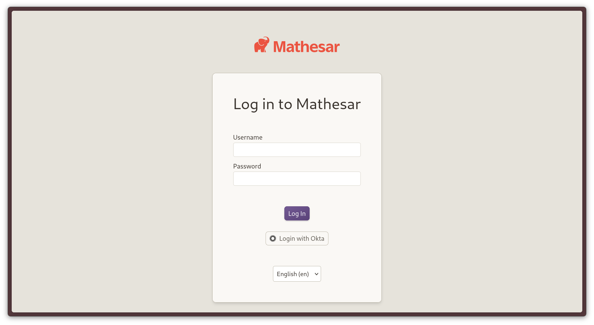
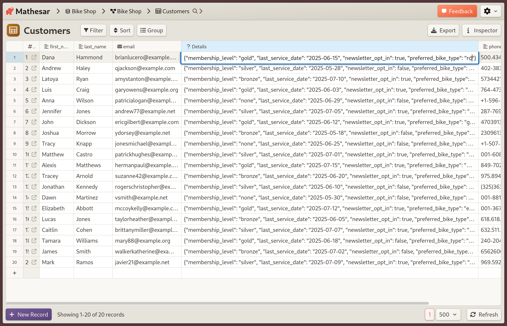

# Mathesar 0.4.0


!!! question "Help us refine forms and files!"
	For our next release, we're actively working on:

	- better support for working with files in Mathesar
	- the ability to create forms (like Google Forms).

	If you're interested in either, we'd love your input! We want to make sure we're prioritizing the right problems to solve. [Talk to us for 20 min](https://cal.com/mathesar/users), we'll give you a $25 gift card as a thank you.

## Summary

Mathesar 0.4.0 introduces support for single sign-on (SSO) using OIDC, DigitalOcean and Railway one-click deployments, and the ability to paste new records directly into Mathesar. The release also includes many smaller enhancements and fixes, such as the ability to view and edit JSON from the UI.

!!! info ""
	This page provides a comprehensive list of all changes in the release.

## Improvements

### Single Sign-on (SSO)


/// caption
A glimpse of Mathesar’s login page with Okta single sign-on enabled.
///

Mathesar administrators can now set up single sign-on (SSO) as an authentication mechanism for their users, allowing them to log in without needing separate credentials. Administrators can also restrict access to specific email domains and assign a default database role for new users.

We support any OpenID Connect (OIDC) identity provider, including Keycloak, Okta, Auth0, Google Workspace, and dozens of others. [See our SSO documentation](../administration/single-sign-on.md) for more information.

*Related work:* [#4634](https://github.com/mathesar-foundation/mathesar/pull/4634 "Single Sign-on (SSO)")

### Bulk creation of new records via paste

<video controls muted playsinline>
  <source src="../../assets/releases/0.4.0/mathesar-040-bulk-paste.mp4" type="video/mp4">
</video>
/// caption
Add 20 new customers by pasting a CSV into your table.
///

You can now bulk-create records within Mathesar's UI by pasting data into the table page. This feature also allows you to import data into existing Mathesar tables from other sources such as spreadsheets.

Previously, Mathesar's support for pasting needed existing rows to hold the data. Now, you can paste new data into the placeholder row at the bottom of a table, and Mathesar will create as many new rows as needed. If your pasted content also overlaps _existing_ records, those will be updated as well.

*Related work:* [#4601](https://github.com/mathesar-foundation/mathesar/pull/4601 "Implement adding rows via paste")

### New one-click installation methods

We've set up official templates to deploy Mathesar to [DigitalOcean](../administration/install-digitalocean.md) and [Railway](../administration/install-railway.md). These options allow you to set up a Mathesar installation without needing to manage server infrastructure or use the command-line.

### Initial support for JSON in UI


/// caption
JSON is viewable and editable in Mathesar's table views.
///

We have added support for viewing and editing `JSON` and `JSONB` data in tables, plus displaying the data correctly in the Data Explorer. Previously, JSON data was displayed as `[object Object]` in cells.

Mathesar now properly displays and supports editing for `JSON` and `JSONB` columns. Previously, these values appeared as `[object Object]` due to a rendering issue.

*Related work:* [#4641](https://github.com/mathesar-foundation/mathesar/pull/4641 "Stringify JSON data returned from database layer")

### Record pages use table column order

<video controls muted playsinline>
  <source src="../../assets/releases/0.4.0/mathesar-040-column-order.mp4" type="video/mp4">
</video>
/// caption
Record pages reflect custom column order from table pages.
///

Previously, pages for individual records listed columns in the order that the database stored them in. Table pages allow columns to be reordered for display, and we've updated record pages to use that same order.

Special thanks to community member [@vishaljoshi789](https://github.com/vishaljoshi789) for the fix.

*Related work:* [#4584](https://github.com/mathesar-foundation/mathesar/pull/4584 "Added table page column order on record pages")

## Groundwork

### Forms

This release includes partial work for allowing users to create public-facing forms to collect data directly in Mathesar. We’ve done initial work on defining core data models, CRUD API endpoints, and listing created forms. This functionality is not exposed in the UI yet.

This functionality is hidden in 0.4.0 but will be published in an upcoming Mathesar release.

*Related work:*

[#4565](https://github.com/mathesar-foundation/mathesar/pull/4565 "Merge Forms feature branch into develop")
[#4536](https://github.com/mathesar-foundation/mathesar/pull/4536 "Add `forms.add` RPC endpoint")
[#4576](https://github.com/mathesar-foundation/mathesar/pull/4576 "Design prototype for listing Forms on the Schema page")
[#4554](https://github.com/mathesar-foundation/mathesar/pull/4554 "Add form `get`, `list` & `delete` RPC endpoints")
[#4577](https://github.com/mathesar-foundation/mathesar/pull/4577 "Add `forms.get_public` rpc endpoint")
[#4525](https://github.com/mathesar-foundation/mathesar/pull/4525 "Form models")
[#4642](https://github.com/mathesar-foundation/mathesar/pull/4642 "Hide forms for 0.4.0")
[#4585](https://github.com/mathesar-foundation/mathesar/pull/4585 "Add `forms.replace` rpc endpoint")
[#4568](https://github.com/mathesar-foundation/mathesar/pull/4568 "Ensure server integrity for forms")

### Experimental "read only" Mathesar role

!!! warning "Use at your own risk"
    This management command may cause unintended behavior and is not fully tested.

We're experimenting with a way to run Mathesar with a read-only Postgres role.

??? info "Instructions for use (Use at your own risk.)"
    1. **Create a PostgreSQL database role** with read-only access to your user data.
    1. **Create a Mathesar user** and assign it to that role.
    1. **Log in as that user** to complete the first-time password setup.
    1. **Run the management command** to restrict Django state:
        ```
		python manage.py add_readonly_django -v 3 mathesar_ro_django
        ```
    1. **Update your `docker-compose.yml`** (or Django settings) to make Mathesar use the read-only `mathesar_ro_django` role for Django.
    1. **Restart the service** to apply the changes.

    The result is an instance that allows login and viewing but blocks any permanent changes to user or app state.


*Related work:* [#4571](https://github.com/mathesar-foundation/mathesar/pull/4571 "EXPERIMENTAL: Add read-only Django role creation")

## Documentation

### Dataset instructions for developers

We’ve clarified our [instructions for loading and using sample datasets](https://github.com/mathesar-foundation/mathesar/blob/develop/DEVELOPER_GUIDE.md#loading-sample-data) to make it easier for contributors to test features and explore the app with realistic data.

*Related work:* [#4581](https://github.com/mathesar-foundation/mathesar/pull/4581 "Clarify sample datasets in the Developer Guide")

## Maintenance

- Add an application name to all database connections and limit the connection pool size to 2. [#4566](https://github.com/mathesar-foundation/mathesar/pull/4566 "Conn leak bug")
- Rename Column & Constraint TS types to make way for models [#4562](https://github.com/mathesar-foundation/mathesar/pull/4562 "Rename Column & Constraint TS types to make way for models")
- Map function calls and their return values with a unique ID to better conform to the JSON-RPC 2.0 spec [#4583](https://github.com/mathesar-foundation/mathesar/pull/4583 "Ensure batched RPC responses are ordered as per the order of requests")
- Allow static props for RPC requests in AsyncRpcApiStore [#4574](https://github.com/mathesar-foundation/mathesar/pull/4574 "Allow static props for RPC requests in AsyncRpcApiStore")
- Work related to our internal workflows:
[#4586](https://github.com/mathesar-foundation/mathesar/pull/4586 "Create roadmap issue template.")
[#4630](https://github.com/mathesar-foundation/mathesar/pull/4630 "Roadmap template update")
[#4631](https://github.com/mathesar-foundation/mathesar/pull/4631 "Add roadmap to README")
[#4611](https://github.com/mathesar-foundation/mathesar/pull/4611 "Add Mathesar version to bug report")
[#4614](https://github.com/mathesar-foundation/mathesar/pull/4614 "Updated default type label associated with roadmap item template.")

## Upgrading to 0.4.0  {:#upgrading}

### For installations using Docker Compose

If you have a Docker compose installation, run the command below:

```
docker compose -f /etc/mathesar/docker-compose.yml up --pull always -d
```

!!! warning "Your installation directory may be different"
    You may need to change `/etc/mathesar/` in the command above if you chose to install Mathesar to a different directory.

### For direct installations of Mathesar on Linux, macOS, or WSL

Mathesar provides an install script that automates both fresh installs and upgrades for standalone (non-Docker) installations.

!!! tip "Previously referred to as "Installation from scratch""
    In versions earlier than 0.3.0, this setup was referred to as "Installation from scratch".

Follow the steps below to upgrade Mathesar:


1. Enter your installation directory into the box below and press <kbd>Enter</kbd> to personalize this guide:

    <input data-input-for="MATHESAR_INSTALL_DIR" aria-label="Your Mathesar installation directory"/>

    - Do _not_ include a trailing slash.
    - Do _not_ use any variables like `$HOME`.

2.  Go to your Mathesar installation directory.

    ```
    cd xMATHESAR_INSTALL_DIRx
    ```

    !!! note
        Your installation directory may be different from above if you used a different directory when installing Mathesar.

3. Download and run the install script for 0.4.0

    ```
    curl -sSfL https://github.com/mathesar-foundation/mathesar/releases/download/0.4.0/install.sh -o install.sh
    chmod +x install.sh

    ./install.sh .
    ```

4. Replace your gunicorn systemd service with a Mathesar systemd service

    1. Disable and stop the existing gunicorn service
        ```
        systemctl disable gunicorn.service
        systemctl stop gunicorn.service
        ```

    2. Follow the steps in [Run Mathesar as a systemd service](../administration/install-from-scratch.md#run-mathesar-as-a-systemd-service) from the installation guide

    3. Remove the gunicorn service file
        ```
        sudo rm /lib/systemd/system/gunicorn.service
        ```

5. Update your Caddyfile

    1. Use the configuration shown in [Install and configure Caddy](.md#install-and-configure-caddy) in the installation guide, and update your Caddyfile accordingly

    2. Ensure that your domains are specified directly in the first line of the Caddyfile

    3. Restart your Caddy service
      ```
      systemctl restart caddy.service
      ```

!!! tip
    **If you're running Mathesar only on localhost and do not want it to run as a service**, you could:

    1. Remove the gunicorn and caddy services
    1. Start Mathesar manually with:
      ```
      mathesar run
      ```
