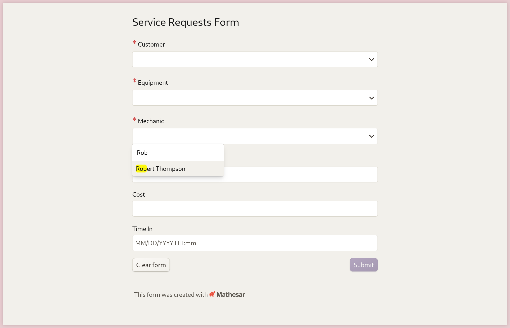
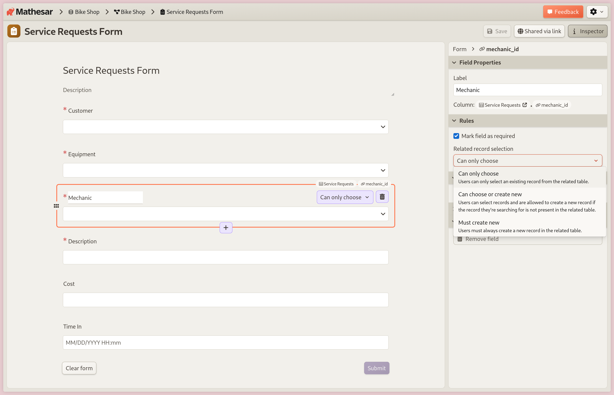
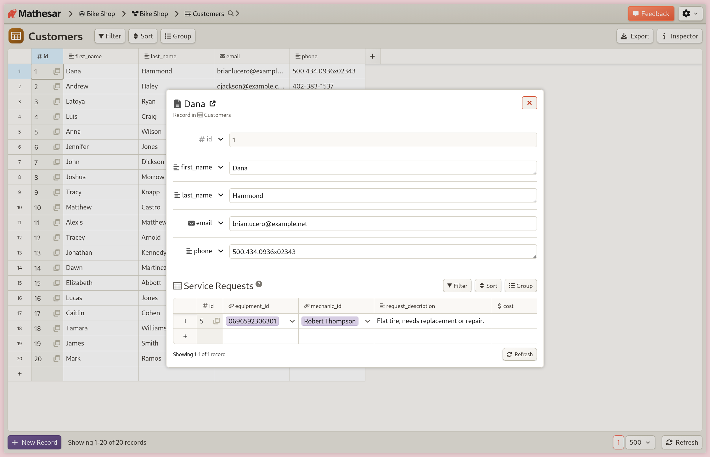
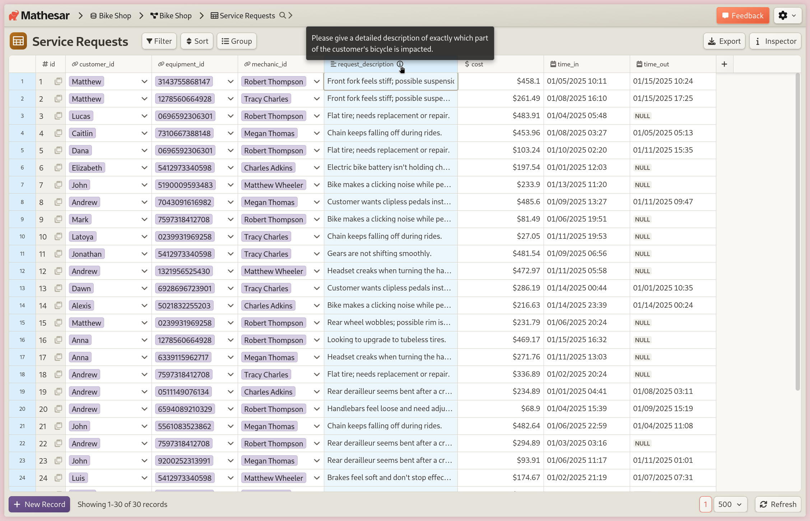
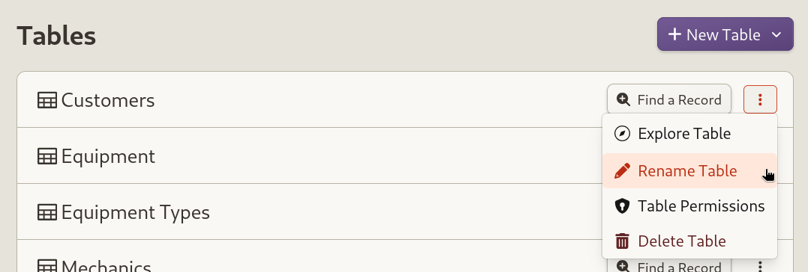

# Mathesar 0.5.0

!!! question "Want files or cross-table editing in Mathesar? Talk to us!"
	For our next release, we're actively working on:

	- better support for working with files in Mathesar
	- the ability to edit data from multiple tables in a single view

	If you're interested in either, we'd love your input so we're prioritizing the right problems to solve. [Talk to us for 20 min](https://cal.com/mathesar/users), we'll give you a $25 gift card as a thank you.

## Summary

Mathesar 0.5.0 introduces the ability to build and customize forms that allow anyone to submit data directly into your database. This release also updates the default single record view to use a modal instead of a separate page, makes column descriptions more prominent, and automates secret key generation during installation.

!!! info ""
	This page provides a comprehensive list of all changes in the release.

## Improvements


### Form builder


/// caption
Create new service requests for a bike shop, choosing from available mechanics.
///

You can now build and share forms that collect information from anyone, without giving them access to your Mathesar installation. Each form is linked to a table, and submissions are automatically saved as new records. Forms are shared via a unique link, and anyone with access to the link can submit responses. 


/// caption
The new form builder allows respondents to choose from and/or create new linked records.
///

You can create forms that connect data across multiple tables, choose which fields to include, and control how related data is handled. Respondents can select from existing records or create new ones on the fly, depending on how you set up the form.

*Related work:*
[#4556](https://github.com/mathesar-foundation/mathesar/pull/4556 "ARCHIVE: Original Row Seeker Prototype") [#4598](https://github.com/mathesar-foundation/mathesar/pull/4598 "Forms backend - Add RPC method to fetch table & column info for form fields") [#4609](https://github.com/mathesar-foundation/mathesar/pull/4609 "Forms frontend") [#4637](https://github.com/mathesar-foundation/mathesar/pull/4637 "Implement Row Seeker within Forms") [#4644](https://github.com/mathesar-foundation/mathesar/pull/4644 "Forms backend - Re-enable forms & remove reverse_fk field type") [#4653](https://github.com/mathesar-foundation/mathesar/pull/4653 "Bump form-data from 4.0.0 to 4.0.4 in /mathesar_ui") [#4657](https://github.com/mathesar-foundation/mathesar/pull/4657 "Implement `forms.submit` RPC method") [#4663](https://github.com/mathesar-foundation/mathesar/pull/4663 "Make TableStructure store hold all structural info and remove TabularData store dependencies (Split from #4609)") [#4664](https://github.com/mathesar-foundation/mathesar/pull/4664 "Separate out common data for anonymous pages (Split from #4609)") [#4665](https://github.com/mathesar-foundation/mathesar/pull/4665 "Make certain components common, general improvements (Split from #4609)") [#4666](https://github.com/mathesar-foundation/mathesar/pull/4666 "Remove sharing specific logic that is no longer used (Split from #4609)") [#4669](https://github.com/mathesar-foundation/mathesar/pull/4669 "Disallow paste into most PK cells") [#4671](https://github.com/mathesar-foundation/mathesar/pull/4671 "Form backend unblockers") [#4673](https://github.com/mathesar-foundation/mathesar/pull/4673 "Forms feature (WIP)") [#4680](https://github.com/mathesar-foundation/mathesar/pull/4680 "Check form permissions before `get`, `get_source_info` and `submit`") [#4681](https://github.com/mathesar-foundation/mathesar/pull/4681 "Forms management UI in Schema page (Split from #4609)") [#4683](https://github.com/mathesar-foundation/mathesar/pull/4683 "Forms replace is patch") [#4691](https://github.com/mathesar-foundation/mathesar/pull/4691 "Forms permission check fix") [#4694](https://github.com/mathesar-foundation/mathesar/pull/4694 "Sort form fields via drag and drop") [#4695](https://github.com/mathesar-foundation/mathesar/pull/4695 "Form row seeker integration improvements") [#4698](https://github.com/mathesar-foundation/mathesar/pull/4698 "Improve responsive behavior of shared form fill-out page") [#4699](https://github.com/mathesar-foundation/mathesar/pull/4699 "Handle FK field interaction behavior for Forms") [#4700](https://github.com/mathesar-foundation/mathesar/pull/4700 "Forms: Throw exception while inserting into a column with fks constraints on multiple columns") [#4701](https://github.com/mathesar-foundation/mathesar/pull/4701 "Forms - Improve error states") [#4704](https://github.com/mathesar-foundation/mathesar/pull/4704 "Remove stale nested fields, implement utility for dynamic nested derived stores") [#4707](https://github.com/mathesar-foundation/mathesar/pull/4707 "Forms polish") [#4710](https://github.com/mathesar-foundation/mathesar/pull/4710 "Forms: cleanup styles, add inspector button") [#4711](https://github.com/mathesar-foundation/mathesar/pull/4711 "Forms post-submission views") [#4713](https://github.com/mathesar-foundation/mathesar/pull/4713 "Forms: UX fixes") [#4726](https://github.com/mathesar-foundation/mathesar/pull/4726 "Add forms analytics") [#4727](https://github.com/mathesar-foundation/mathesar/pull/4727 "Fix QA issues - 0.5.0")


### Single record view modal


/// caption
View a customer's service requests without leaving the table page.
///

Single record links in the table page now open a modal instead of a separate page. You can still access the full single record page via a link in the modal. This change aims to make it easier for users to review and edit records without losing context.

*Related work:*
[#4674](https://github.com/mathesar-foundation/mathesar/pull/4674 "Modal record view") [#4659](https://github.com/mathesar-foundation/mathesar/pull/4659 "Improve focus behavior for modals")

### More prominent column descriptions



Column headers in the table page now show icons when the column has a description. The description is displayed on hover. This eliminates the need to open the Inspector to see column descriptions.

*Related work:*
[#4685](https://github.com/mathesar-foundation/mathesar/pull/4685 "Display column descriptions in column header cells")

### Automatic `SECRET_KEY` generation during install

We've automated generating and persisting the `SECRET_KEY` variable during the Mathesar installation process. You may also provide your own `SECRET_KEY`, which will override the automatically generated one. 

This simplifies some installation methods by removing the need for a previously fully manual step. However, you must still supply a `SECRET_KEY` manually when deploying on platforms without a persistent filesystem such as [DigitalOcean's App Platform](../administration/install-digitalocean.md), to ensure stability across restarts.

*Related work:*
[#4597](https://github.com/mathesar-foundation/mathesar/pull/4597 "Generate and persist `SECRET_KEY` by default")

### Clarified "edit" and "rename" actions in some menus



We've created a better distinction between actions that involve editing a resource and renaming a resource, for objects like tables, schemas, and forms. This was aimed at improving UX by better reflecting the purpose of the action.

*Related work:*
[#4709](https://github.com/mathesar-foundation/mathesar/pull/4709 "Change some UI terminology from edit to rename")

## Bug Fixes

- Fix UI delays when changing the table page result size [#4686](https://github.com/mathesar-foundation/mathesar/pull/4686 "Fix UI hang issues")
- Add a default value for the `OIDC_CONFIG_DICT` [#4667](https://github.com/mathesar-foundation/mathesar/pull/4667 "Add default for OIDC_CONFIG_DICT")

## Maintenance

- Write 0.5.0 Release notes [#4716](https://github.com/mathesar-foundation/mathesar/pull/4716 "0.5.0 Release notes")
- Update the setuptools package to 78.1.1 [#4484](https://github.com/mathesar-foundation/mathesar/pull/4484 "Bump setuptools from 75.5.0 to 78.1.1 in /docs")
- Remove a duplicated line from the 0.4.0 release notes [#4662](https://github.com/mathesar-foundation/mathesar/pull/4662 "Removed duplicate line.") [#4668](https://github.com/mathesar-foundation/mathesar/pull/4668 "Merge pull request #4662 from mathesar-foundation/kgodey-patch-1")


## Upgrading to 0.5.0 {:#upgrading}

### For installations using Docker Compose

If you have a Docker compose installation, run the command below:

```
docker compose -f /etc/mathesar/docker-compose.yml up --pull always -d
```

!!! warning "Your installation directory may be different"
    You may need to change `/etc/mathesar/` in the command above if you chose to install Mathesar to a different directory.

### For direct installations of Mathesar on Linux, macOS, or WSL

Mathesar provides an install script that automates both fresh installs and upgrades for standalone (non-Docker) installations.

!!! tip "Previously referred to as "Installation from scratch""
    In versions earlier than 0.3.0, this setup was referred to as "Installation from scratch".

Follow the steps below to upgrade Mathesar:


1. Enter your installation directory into the box below and press <kbd>Enter</kbd> to personalize this guide:

    <input data-input-for="MATHESAR_INSTALL_DIR" aria-label="Your Mathesar installation directory"/>

    - Do _not_ include a trailing slash.
    - Do _not_ use any variables like `$HOME`.

2.  Go to your Mathesar installation directory.

    ```
    cd xMATHESAR_INSTALL_DIRx
    ```

    !!! note
        Your installation directory may be different from above if you used a different directory when installing Mathesar.

3. Download and run the install script for 0.5.0
    ```
    curl -sSfL https://github.com/mathesar-foundation/mathesar/releases/download/0.5.0/nstall.sh -o install.sh
    chmod +x install.sh

    ./install.sh .
    ```

4. Replace your gunicorn systemd service with a Mathesar systemd service

    1. Disable and stop the existing gunicorn service
        ```
        systemctl disable gunicorn.service
        systemctl stop gunicorn.service
        ```

    2. Follow the steps in [Run Mathesar as a systemd service](../administration/install-from-scratch.md#run-mathesar-as-a-systemd-service) from the installation guide

    3. Remove the gunicorn service file
        ```
        sudo rm /lib/systemd/system/gunicorn.service
        ```

5. Update your Caddyfile

    1. Use the configuration shown in [Install and configure Caddy](.md#install-and-configure-caddy) in the installation guide, and update your Caddyfile accordingly

    2. Ensure that your domains are specified directly in the first line of the Caddyfile

    3. Restart your Caddy service
      ```
      systemctl restart caddy.service
      ```

!!! tip
    **If you're running Mathesar only on localhost and do not want it to run as a service**, you could:

    1. Remove the gunicorn and caddy services
    1. Start Mathesar manually with:
      ```
      mathesar run
      ```
