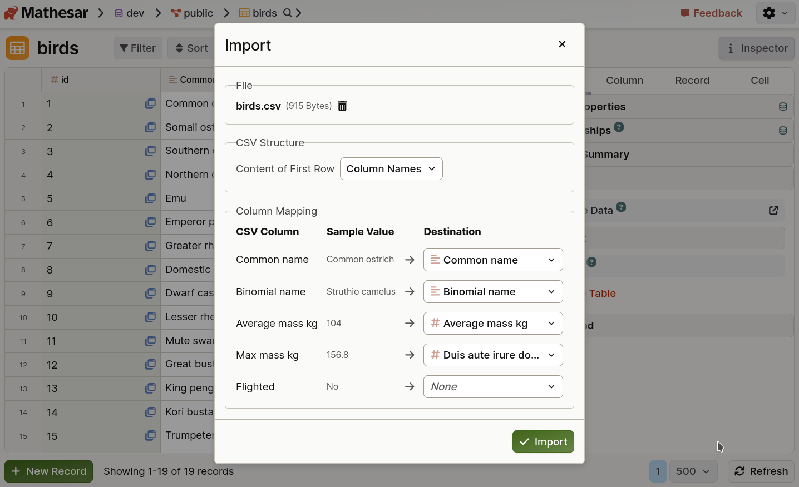

# Mathesar 0.7.0

!!! question "Want cross-table editing in Mathesar? Talk to us!"
	For our next release, we're actively working on the ability to edit data from multiple tables in a single view.

	If you're interested, we'd love your input so we're prioritizing the right problems to solve. [Talk to us for 20 min](https://cal.com/mathesar/users), we'll give you a $25 gift card as a thank you.

## Summary

Mathesar 0.7.0 introduces CSV imports into existing tables, the ability to export results from data explorations, and support for file uploads in forms. This release also includes improvements to cell context menus, pasting behavior, and several bug fixes and polish updates across the app.

!!! info ""
	  This page provides a comprehensive list of all changes in the release.

## Improvements

### Import CSV data into existing tables



You can now import CSV files directly into an existing Mathesar table. Headers are automatically matched to column names where possible, and you can map any remaining columns manually. You are also able to specify whether the CSV contains a header row.

*Related work:*

[#4866](https://github.com/mathesar-foundation/mathesar/pull/4866 "UI for importing into existing tables")
[#4870](https://github.com/mathesar-foundation/mathesar/pull/4870 "Implement bulk insert")

### Export data exploration results


Explorations can now be exported as CSV files via an "export" button in the top right corner of the exploration view, allowing you to share or analyze query results outside of Mathesar.

*Related work:*

[#4854](https://github.com/mathesar-foundation/mathesar/pull/4854 "Export explorations")

### File uploads in forms


///caption
Configure a form in Mathesar (the light mode screen) to accept print jobs via anonymous form submission (dark mode screen), now complete with file uploads.
///

Forms now support uploading files, enabling richer submissions from users. Uploaded files are previewable directly within the form interface.

To enable this feature:

- [Configure your file storage backend](../administration/file-backend-config.md)
- (optional) Set a global maximum file size for anonymous uploads

*Related work:*

[#4852](https://github.com/mathesar-foundation/mathesar/pull/4852 "Add files to forms - Frontend") [#4848](https://github.com/mathesar-foundation/mathesar/pull/4848 "Add files to forms - backend")


### Improved cell context menus

Right-click context menus have been redesigned to better support multi-selection and more efficient actions. You can now select and delete multiple rows at once, and actions are organized into submenus for easier navigation and future expansion.

*Related work:*

[#4836](https://github.com/mathesar-foundation/mathesar/pull/4836 "Improve cell context menus") [#4865](https://github.com/mathesar-foundation/mathesar/pull/4865 "Fix infinite recursion bug in context menu - focus behaviour")

### Faster numeric and money imports

Importing large CSV or TSV files with numeric or money columns is now significantly faster.
Mathesar now uses optimized casting functions for these types during import, cutting processing times dramatically—up to 97% faster in internal benchmarks for large datasets (500K rows).

*Related work:*

[#4821](https://github.com/mathesar-foundation/mathesar/pull/4821 "Fast money and numeric cast during import")

### Added support for PostgreSQL 18

Mathesar now supports the latest version of PostgreSQL, version 18, [released on September 25th](https://www.postgresql.org/about/news/postgresql-18-released-3142/).

*Related work:*

[#4874](https://github.com/mathesar-foundation/mathesar/pull/4874 "Add PG 18 to CI")

## Bug fixes

- Preserve sort conditions after re-ordering columns [#4839](https://github.com/mathesar-foundation/mathesar/pull/4839 "Fix for Persisting Sorting Conditions when Re-ordering Columns")
- Correctly set foreign keys when creating related records via paste in the table widget [#4815](https://github.com/mathesar-foundation/mathesar/pull/4815 "Adds foreign key to new records created via paste in the table widget")
- Fix casting regression from integer-like to text-like columns [#4868](https://github.com/mathesar-foundation/mathesar/pull/4868 "Fix casting func regression")

## Documentation

- Add developer docs for working with file attachments [#4840](https://github.com/mathesar-foundation/mathesar/pull/4840 "Add dev docs for working with file attachments")
- Added issue template for managing technical debt [#4869](https://github.com/mathesar-foundation/mathesar/pull/4869 "add tech debt issue template")

## Maintenance

- Improve errors when column alterations fail [#4787](https://github.com/mathesar-foundation/mathesar/pull/4787 "Alter column refactor")
- Bump django from 4.2.24 to 4.2.25 [#4843](https://github.com/mathesar-foundation/mathesar/pull/4843 "Bump django from 4.2.24 to 4.2.25")
- Fix typos in the "Custom Database Nickname" help text [#4842](https://github.com/mathesar-foundation/mathesar/pull/4842 "fix: typos")
- Remove redundant `launchRecordSelector` callback [#4838](https://github.com/mathesar-foundation/mathesar/pull/4838 "Remove a redundant launchRecordSelector on click in LinkedRecordInput")
- Experiment with concurrency changes
[#4861](https://github.com/mathesar-foundation/mathesar/pull/4861 "Switch to gevent worker for Gunicorn") [#4929](https://github.com/mathesar-foundation/mathesar/pull/4929)

## Upcoming changes in 0.8.0

Mathesar's 0.8.0 release will end official support for PostgreSQL 13 and Python 3.9. We recommend upgrading these dependencies prior to installing 0.8.0 to ensure continued compatibility and support.

While Mathesar is likely to function with older versions, compatibility is no longer tested, and assistance cannot be provided for issues encountered on unsupported versions.

Learn more about our [version support strategy](../administration/version-support.md).

## Upgrading to 0.7.0 {:#upgrading}

### For installations using Docker Compose

If you have a Docker compose installation, run the command below:

```
docker compose -f /etc/mathesar/docker-compose.yml up --pull always -d
```

!!! warning "Your installation directory may be different"
    You may need to change `/etc/mathesar/` in the command above if you chose to install Mathesar to a different directory.

### For direct installations of Mathesar on Linux, macOS, or WSL

Mathesar provides an install script that automates both fresh installs and upgrades for standalone (non-Docker) installations.

Follow the steps below to upgrade Mathesar:


1. Enter your installation directory into the box below and press <kbd>Enter</kbd> to personalize this guide:

    <input data-input-for="MATHESAR_INSTALL_DIR" aria-label="Your Mathesar installation directory"/>

    - Do _not_ include a trailing slash.
    - Do _not_ use any variables like `$HOME`.

2.  Go to your Mathesar installation directory.

    ```
    cd xMATHESAR_INSTALL_DIRx
    ```

    !!! note
        Your installation directory may be different from above if you used a different directory when installing Mathesar.

3. Download and run the install script for 0.7.0
    ```
    curl -sSfL https://github.com/mathesar-foundation/mathesar/releases/download/0.7.0/nstall.sh -o install.sh
    chmod +x install.sh

    ./install.sh .
    ```

4. Replace your gunicorn systemd service with a Mathesar systemd service

    1. Disable and stop the existing gunicorn service
        ```
        systemctl disable gunicorn.service
        systemctl stop gunicorn.service
        ```

    2. Follow the steps in [Run Mathesar as a systemd service](../administration/install-from-scratch.md#run-mathesar-as-a-systemd-service) from the installation guide

    3. Remove the gunicorn service file
        ```
        sudo rm /lib/systemd/system/gunicorn.service
        ```

5. Update your Caddyfile

    1. Use the configuration shown in [Install and configure Caddy](../administration//install-from-scratch.md#install-and-configure-caddy) in the installation guide, and update your Caddyfile accordingly

    2. Ensure that your domains are specified directly in the first line of the Caddyfile

    3. Restart your Caddy service
      ```
      systemctl restart caddy.service
      ```

!!! tip
    **If you're running Mathesar only on localhost and do not want it to run as a service**, you could:

    1. Remove the gunicorn and caddy services
    1. Start Mathesar manually with:
      ```
      mathesar run
      ```
