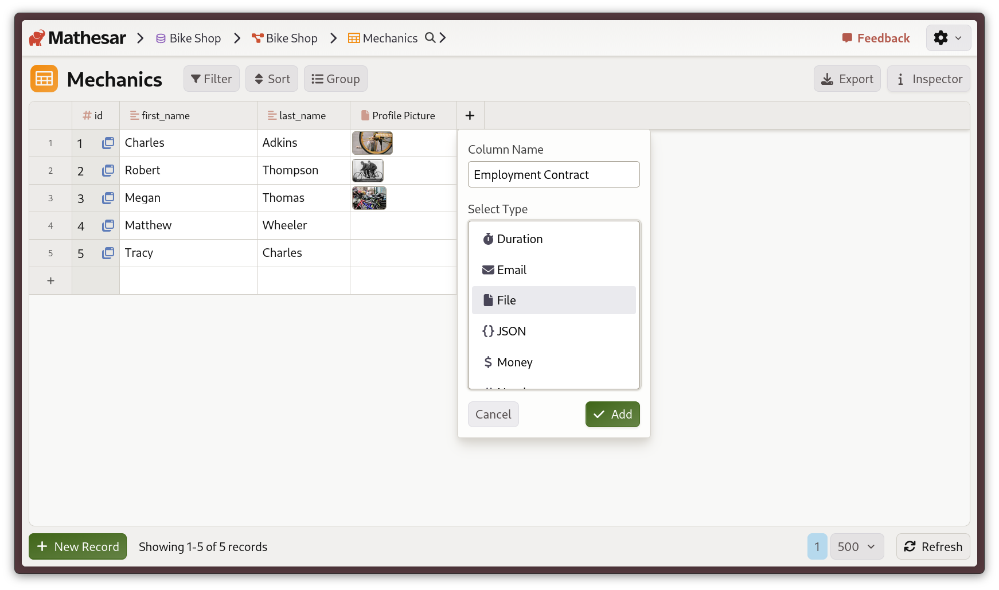
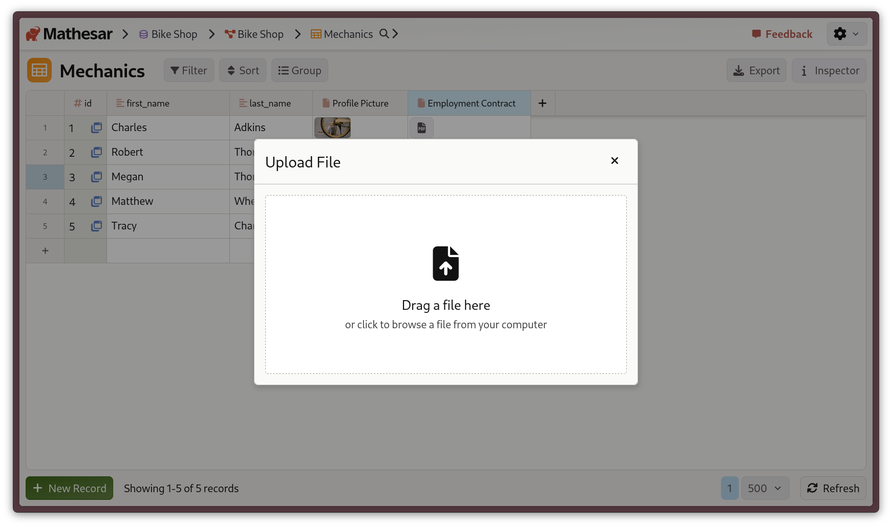

# File columns in Mathesar

!!! question "Help us refine file storage!"
    We would like to support a wide variety of backends, storage formats, and use cases for file storage. If you need something beyond what’s currently documented, [schedule a call with us](https://cal.com/mathesar/users) to let us know your requirements.

Mathesar supports **file columns** which allow you to attach and interact with files of any type. These columns make it easy to store and preview files alongside your structured data.

- All file types are supported.
- Image files display a **thumbnail preview**, which can be clicked to view a larger version.
- All files can be **downloaded or removed** from a row.

## Enabling file columns

To enable file columns in Mathesar, see our guide for how to [configure a file storage backend](../administration/file-backend-config.md). At present, Mathesar _only_ supports storing files on an **S3-compatible object storage backend**.

Once you have configured a backend, users with edit permissions on a table can add a file column and begin uploading files.

## Adding file columns


/// caption
A bike shop owner adding an "Employment Contract" column to their "Mechanics" table.
///

Adding a file column works just like adding any other column type in Mathesar:

1. Open the table where you want to add files.
2. Click the "+" icon **Add Column**.
3. Choose **File** as the column type and name the column.
4. Save your changes.

Once the file column is created, you’ll be able to upload files into it directly from the Mathesar UI.

## Uploading files

To upload a file into a file cell, click the cell's "+" icon and upload an image using the file upload dialog:



## Viewing files

Once uploaded, you'll now see a preview of your file in the cell:

- **For image files**, Mathesar will show a thumbnail preview which can be clicked to view a larger preview in a lightbox.
- **For all other files**, Mathesar will display a file icon which can be clicked to show the file path and other details.

## Tips and technical information

### Working with multiple files per row

You'll notice that each cell in a file column supports **only one file**. However, you can add as many different file columns to a row as you like.

For example, in an **Orders** table you might add:

- an **Invoice** column for storing a PDF invoice
- a **Receipt Photo** column for storing one image of the receipt

If you need to store many, contextually-related files per record, use a relational database approach.

For instance, if each order should have many photos attached:

1. Create a separate table called **Order Photos** with a file column.
2. Add a foreign key from **Order Photos** back to **Orders**.
3. Now each order can have as many photos as you like, while still keeping your schema clean.

 In the future, we plan to improve on this workflow by making it easier to see columns across tables in the same view.

### How files are stored

Files are stored in your PostgreSQL database in `JSONB` columns. A typical file value looks like this:

```json
{
  "uri": "s3://my-mathesar-bucket/admin/20250919-192215167015/example.csv",
  "mash": "58f47a1eafd567cd9d0bdfa1f42a01978cc6f36eb7937b310b208d9957b7ee8b"
}
```

### Removing file backends

If you remove a file backend, you'll no longer see the "File" option in the add column dropdown. Existing file data will be preserved in your database, but in Mathesar's UI you'll see the underlying JSONB instead of image thumbnails or file icons.
