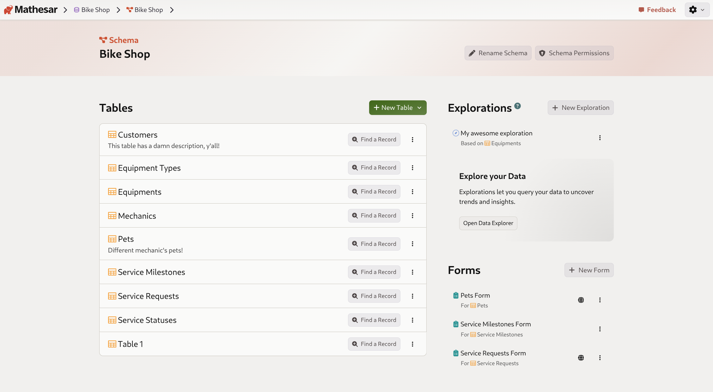
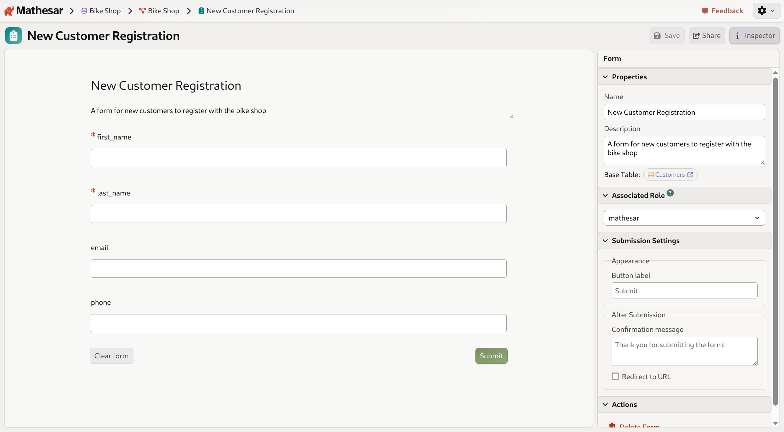
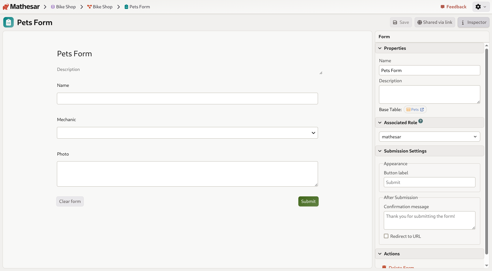
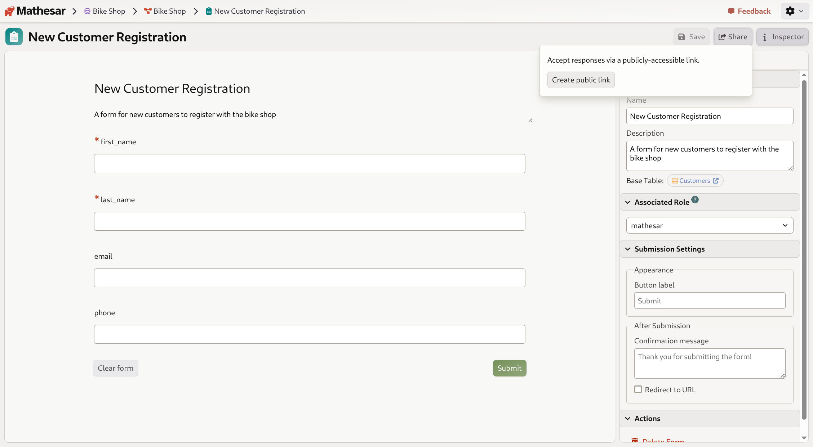
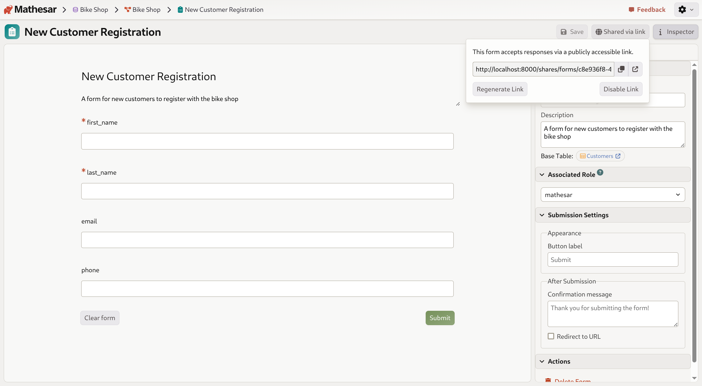
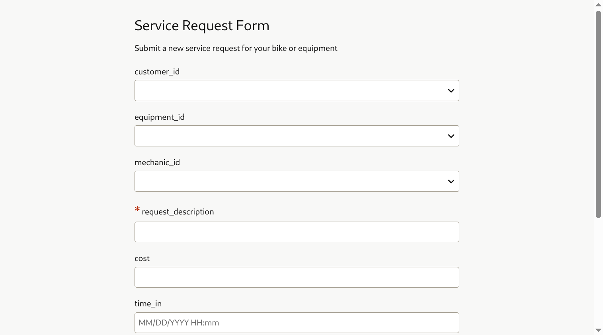
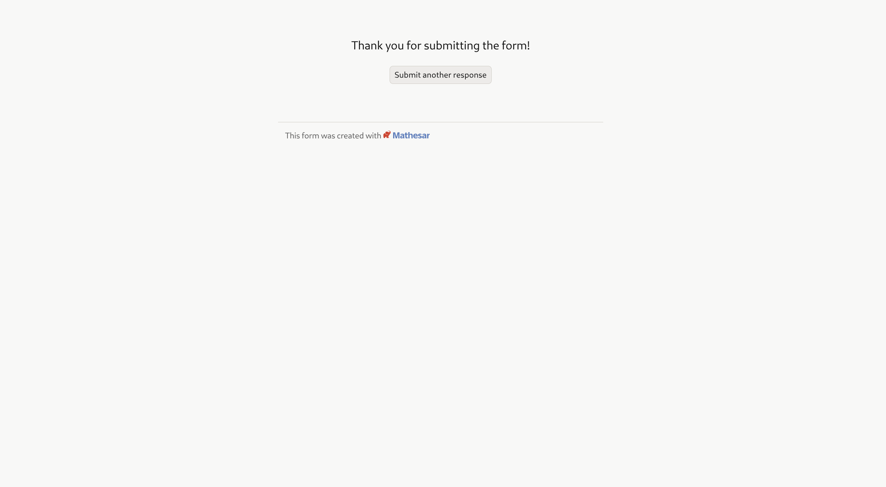
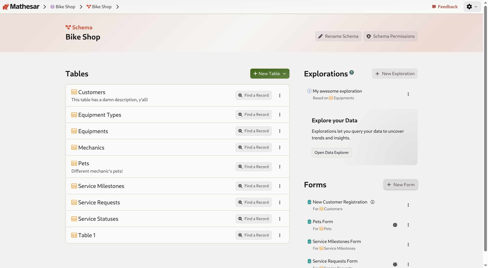

# Working with forms in Mathesar

Mathesar's **forms feature** allows you to create public-facing data collection forms that insert records directly into your database tables. Forms provide a simple, user-friendly interface for collecting structured data without requiring database access.

- Forms are based on existing database tables
- All table columns can be included as form fields
- Forms support various field types including text, numbers, dates, foreign keys, and files
- Forms can be shared via public links
- Submission settings are fully customizable

## Creating a form

Forms are created at the schema level and are linked to a specific base table where submitted data will be stored.

### Steps to create a form

1. Navigate to the schema page where you want to create a form
2. Scroll down to the **Forms** section
3. Click the **New Form** button

/// caption
The Forms section on the schema page, showing existing forms and the "New Form" button.
///

4. In the "Create New Form" dialog, select a **Base Table** from the dropdown

/// caption
Choose which table will receive the form submissions.
///

5. Enter a **Name** for your form (optional - defaults to "[Table Name] Form")
6. Enter a **Description** to explain the form's purpose (optional)

/// caption
Creating a "New Customer Registration" form for the Customers table.
///

7. Click **Save** to create the form

Once created, your new form will appear in the Forms list on the schema page.

## Configuring a form

After creating a form, you can customize its appearance, behavior, and submission settings using the form editor.

### Accessing the form editor

Click on a form name in the Forms list to open the form editor. The editor shows a live preview of your form on the left and an inspector panel on the right.

/// caption
The form editor showing a preview and the inspector panel with configuration options.
///

### Form properties

In the **Properties** section of the inspector panel, you can:

- Edit the form **Name**
- Edit the form **Description**
- View the **Base Table** (clicking it navigates to the table)

### Associated role

The **Associated Role** setting determines which PostgreSQL role will be used to insert records when the form is submitted. This allows you to control what permissions form submissions have.

By default, forms use the `mathesar` role. You can select a different role from the dropdown to apply more restrictive permissions if needed.

### Submission settings

The **Submission Settings** section lets you customize the user experience:

#### Appearance

- **Button label**: Customize the text on the submit button (default: "Submit")

#### After Submission

- **Confirmation message**: Set a custom message shown after successful submission (default: "Thank you for submitting the form!")
- **Redirect to URL**: Enable this checkbox to redirect users to a specific URL after submission instead of showing a confirmation message

### Form fields

The form automatically includes fields for all columns in the base table:

- **Required fields** are marked with a red asterisk (*)
- **Text columns** appear as text input fields
- **Foreign key columns** appear as dropdown selectors
- **File columns** appear as file upload fields
- Field labels are based on column names

/// caption
A form showing different field types including text, foreign key (Mechanic), and file (Photo) fields.
///

## Sharing a form

To allow external users to submit data through your form, you need to create a public link.

### Creating a public link

1. Open the form in the form editor
2. Click the **Share** button in the top-right toolbar

/// caption
The Share panel before creating a public link.
///

3. Click **Create public link**

Once created, you'll see:
- The public URL for your form
- A copy button to easily copy the link
- An open link button to test the form
- Options to **Regenerate Link** or **Disable Link**

/// caption
After creating a public link, you can copy and share it with anyone.
///

### Link security

- Public form links are unique and cannot be guessed
- Anyone with the link can submit data to your database
- You can regenerate the link at any time to invalidate the old URL
- Disabling the link prevents all submissions until you create a new link

## Submitting a form

When users access your form via the public link, they see a clean, simple interface.

/// caption
How the form appears to users accessing it via the public link.
///

### The submission process

1. Users fill out the form fields
2. Required fields must be completed before submission
3. Click the **Submit** button (or your custom button label)
4. Upon success, users see the confirmation message

/// caption
The success message shown after submitting a form.
///

5. Users can click **Submit another response** to submit additional entries

### What happens to submitted data

- Each form submission creates a new row in the base table
- Data is validated according to the column types and constraints
- Foreign key fields validate that selected records exist
- File uploads are stored in your configured file backend

## Managing forms

### Viewing all forms

All forms for a schema are listed in the Forms section on the schema page. Each form shows:

- The form name
- The base table it's connected to ("For [Table Name]")
- A public link icon (if the form has been shared)
- A menu button for additional options

/// caption
The Forms section showing multiple forms for different tables.
///

### Editing a form

To edit an existing form:

1. Click on the form name in the Forms list
2. Make your changes in the form editor
3. Changes are saved automatically

### Deleting a form

To delete a form:

1. Open the form in the form editor
2. Expand the **Actions** section in the inspector panel
3. Click **Delete Form**
4. Confirm the deletion

!!! warning "Deleting forms"
    Deleting a form does not delete the records that were submitted through it. Those records remain in your database table. Only the form configuration is deleted.

## Use cases

Forms are particularly useful for:

- **Customer intake**: Collect information from new customers or clients
- **Event registration**: Allow people to sign up for events
- **Contact forms**: Receive inquiries or support requests
- **Surveys**: Gather feedback or research data
- **Job applications**: Collect candidate information
- **Service requests**: Let customers submit service or support tickets

By combining forms with Mathesar's database features like relationships and data validation, you can create sophisticated data collection workflows while maintaining data integrity.
