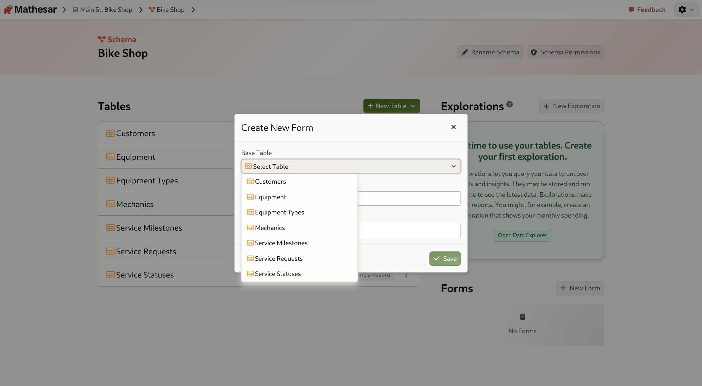
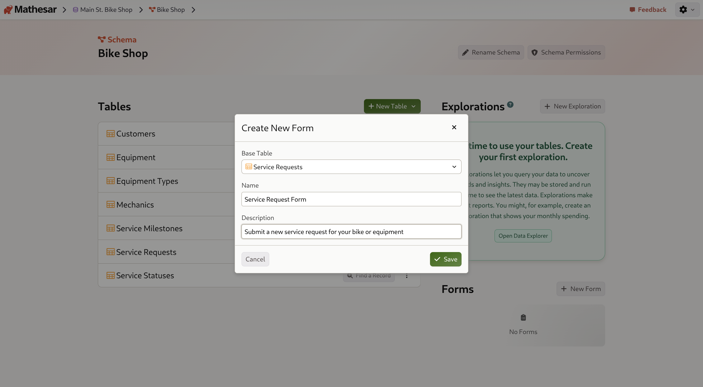
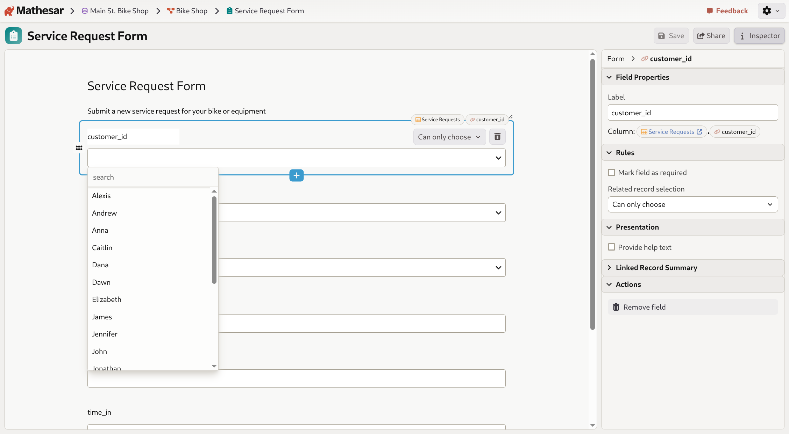
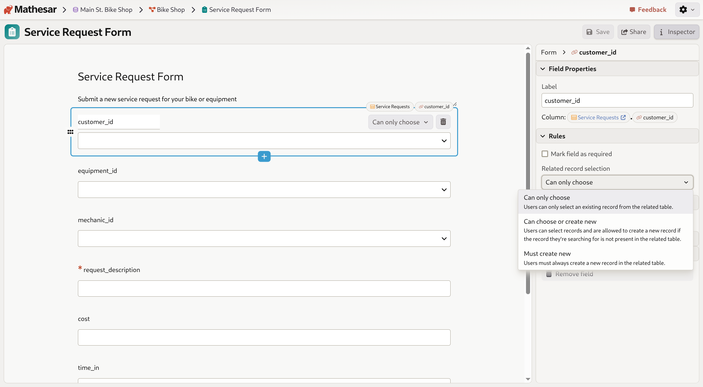
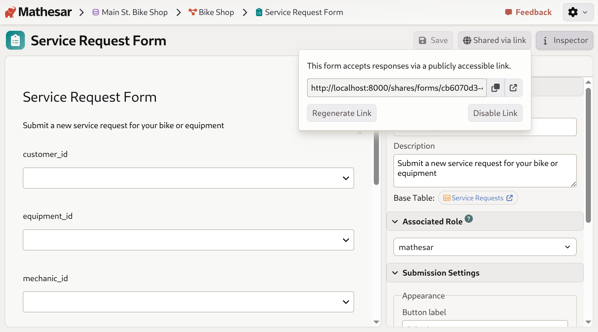
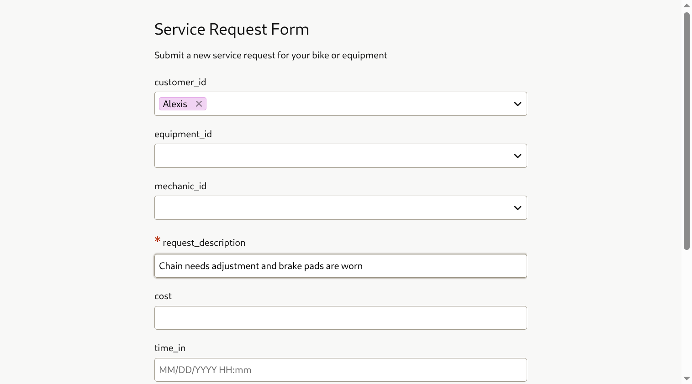

# Working with forms in Mathesar

Mathesar's **form builder** allows you to create public-facing data collection forms that insert records directly into your database tables. Forms provide a simple, user-friendly interface for collecting structured data without requiring database access.

- Forms are based on existing database tables
- All table columns can be included as form fields
- Forms support various field types including text, numbers, dates, foreign keys, and files
- Forms can be shared via public links
- Submission settings are fully customizable

## Creating a form

Forms are created at the schema level and are linked to a specific base table where submitted data will be stored.

### Steps to create a form

1. Navigate to the schema page where you want to create a form
2. Scroll down to the **Forms** section
3. Click the **New Form** button

/// caption
The Forms section on the schema page, showing the "New Form" button and the "Create New Form" modal.
///

4. In the "Create New Form" dialog, select a **Base Table** from the dropdown

/// caption
Choose which table will receive the form submissions. Here, we're selecting the "Service Requests" table.
///

5. Enter a **Name** for your form (optional - defaults to "[Table Name] Form")
6. Enter a **Description** to explain the form's purpose (optional)

/// caption
Creating a "Service Request Form" for the Service Requests table.
///

7. Click **Save** to create the form

Once created, your new form will appear in the Forms list on the schema page.

/// caption
The newly created form appears in the Forms section.
///

## Configuring a form

After creating a form, you can customize its appearance, behavior, and submission settings using the form editor.

### Accessing the form editor

Click on a form name in the Forms list to open the form editor. The editor shows a live preview of your form on the left and an inspector panel on the right.

/// caption
The form editor showing a preview of the Service Request Form and the inspector panel with configuration options.
///

### Form properties

In the **Properties** section of the inspector panel, you can:

- Edit the form **Name**
- Edit the form **Description**
- View the **Base Table** (clicking it navigates to the table)

### Associated role

The **Associated Role** setting determines which PostgreSQL role will be used to insert records when the form is submitted. This allows you to control what permissions form submissions have.

By default, forms use the `mathesar` role. You can select a different role from the dropdown to apply more restrictive permissions if needed.

For more information about form roles and security, see the [Forms configuration guide](../administration/forms-config.md).

### Submission settings

The **Submission Settings** section lets you customize the user experience:

#### Appearance

- **Button label**: Customize the text on the submit button (default: "Submit")

#### After Submission

- **Confirmation message**: Set a custom message shown after successful submission (default: "Thank you for submitting the form!")
- **Redirect to URL**: Enable this checkbox to redirect users to a specific URL after submission instead of showing a confirmation message

### Form fields

The form automatically includes fields for all columns in the base table:

- **Required fields** are marked with a red asterisk (*)
- **Text columns** appear as text input fields
- **Date and time columns** appear with appropriate input formatting
- **Numeric columns** accept numeric input
- **Foreign key columns** appear as dropdown selectors (see [Foreign Key Fields](#foreign-key-fields-in-forms) below)
- **File columns** appear as file upload fields (see [File Upload Fields](#file-upload-fields-in-forms) below)
- Field labels are based on column names

!!! note "Primary keys with dynamic defaults"
    Primary key columns with dynamic default values (such as sequences or UUID generators) are automatically excluded from forms, as these values are generated by the database during insertion.

## Foreign Key Fields in Forms

Foreign key columns in your table appear as dropdown selectors in forms, allowing users to select related records from the referenced table.

### Selecting existing records

When a foreign key field is set to **"Can only choose"** mode, users can only select from existing records:

/// caption
Configuring a foreign key field in the form editor. The "Related record selection" dropdown shows the interaction mode options.
///

### Interaction modes

You can configure how users interact with foreign key fields by selecting one of three interaction modes in the field's **Rules** section:

#### Can only choose

Users can only select an existing record from the related table. This is the default mode for foreign key fields.

#### Can choose or create new

Users can select existing records, and if they can't find what they're looking for, they can create a new record in the related table directly from the form.

/// caption
The three interaction modes available for foreign key fields in forms.
///

When this mode is enabled, additional fields from the related table appear below the foreign key field, allowing users to enter data for a new record:

/// caption
When "Can choose or create new" is selected, nested fields appear below the foreign key field for creating new related records.
///

These nested fields only appear when the user chooses to create a new record, keeping the form clean for users who are selecting existing records.

#### Must create new

Users must always create a new record in the related table. This mode is useful when you want to ensure each form submission creates records in multiple related tables.

### Configuring foreign key fields

To configure a foreign key field's interaction mode:

1. Click on the foreign key field in the form preview
2. In the inspector panel, expand the **Rules** section
3. Use the **Related record selection** dropdown to choose the interaction mode
4. The form preview updates automatically to show the selected mode

## File Upload Fields in Forms

Forms support file uploads when your table includes file columns. File columns appear as file upload fields in forms, allowing users to attach files to their submissions.

!!! note "File storage backend required"
    File uploads in forms require a configured [file storage backend](../administration/file-backend-config.md). If no file backend is configured, file columns will not appear in forms.

### Using file fields in forms

When a form includes a file column, users see a file upload button in the public form view:

/// caption
The public form view showing a file upload field for the "photo" column.
///

Clicking the upload button opens a file selection dialog:

/// caption
The file upload interface allows users to drag and drop files or browse to select a file.
///

### File upload capabilities

- **All file types are supported**: Images, documents, PDFs, and any other file type
- **File preview**: Uploaded files can be previewed directly in the form before submission
- **File size limits**: Administrators can configure maximum file sizes for public form uploads (see [Forms configuration](../administration/forms-config.md))
- **File storage**: Uploaded files are stored in your configured S3-compatible backend

### Configuration for file uploads

File uploads in public forms are controlled by the `public_form_access` setting in your `file_storage.yml` configuration file. See the [Forms configuration guide](../administration/forms-config.md) for details on:

- Enabling or disabling file uploads in public forms
- Setting maximum file size limits
- Security considerations for anonymous file uploads

## Sharing a form

To allow external users to submit data through your form, you need to create a public link.

### Creating a public link

1. Open the form in the form editor
2. Click the **Share** button in the top-right toolbar

/// caption
The Share panel before creating a public link.
///

3. Click **Create public link**

Once created, you'll see:
- The public URL for your form
- A copy button to easily copy the link
- An open link button to test the form
- Options to **Regenerate Link** or **Disable Link**

/// caption
After creating a public link, you can copy and share it with anyone.
///

### Link security

- Public form links are unique and cannot be guessed
- Anyone with the link can submit data to your database
- You can regenerate the link at any time to invalidate the old URL
- Disabling the link prevents all submissions until you create a new link

## Submitting a form

When users access your form via the public link, they see a clean, simple interface.

/// caption
How the form appears to users accessing it via the public link.
///

### The submission process

1. Users fill out the form fields
2. For foreign key fields, users can select from existing records using the dropdown

/// caption
Users can search and select existing records from foreign key dropdowns in the public form.
///

3. Required fields must be completed before submission
4. Click the **Submit** button (or your custom button label)
5. Upon success, users see the confirmation message

/// caption
The success message shown after submitting a form.
///

6. Users can click **Submit another response** to submit additional entries

### Example: Filling out a service request form

/// caption
A completed service request form with a customer selected and request description entered.
///

### What happens to submitted data

- Each form submission creates a new row in the base table
- Data is validated according to the column types and constraints
- Foreign key fields validate that selected records exist
- If a foreign key field is set to create new records, new rows are inserted into the related table first
- File uploads are stored in your configured file backend
- The associated PostgreSQL role determines what permissions are used for the insert operation

## Managing forms

### Viewing all forms

All forms for a schema are listed in the Forms section on the schema page. Each form shows:

- The form name
- The base table it's connected to ("For [Table Name]")
- A public link icon (if the form has been shared)
- A menu button for additional options

### Editing a form

To edit an existing form:

1. Click on the form name in the Forms list
2. Make your changes in the form editor
3. Changes are saved automatically

### Deleting a form

To delete a form:

1. Open the form in the form editor
2. Expand the **Actions** section in the inspector panel
3. Click **Delete Form**
4. Confirm the deletion

!!! warning "Deleting forms"
    Deleting a form does not delete the records that were submitted through it. Those records remain in your database table. Only the form configuration is deleted.

## Use cases

Forms are particularly useful for:

- **Service requests**: Let customers submit service or support tickets (as shown in our Service Requests example)
- **Customer intake**: Collect information from new customers or clients
- **Event registration**: Allow people to sign up for events
- **Contact forms**: Receive inquiries or support requests
- **Surveys**: Gather feedback or research data
- **Job applications**: Collect candidate information

By combining forms with Mathesar's database features like relationships and data validation, you can create sophisticated data collection workflows while maintaining data integrity. The ability to create related records inline and upload files makes forms even more powerful for real-world data collection scenarios.
