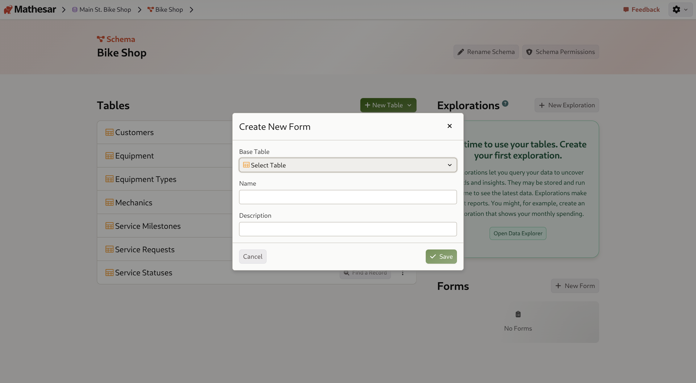
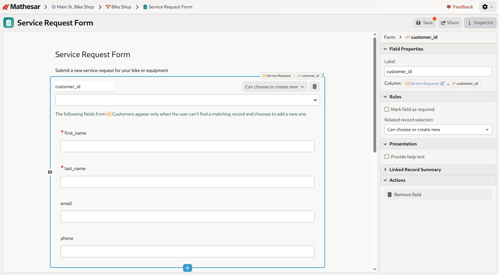
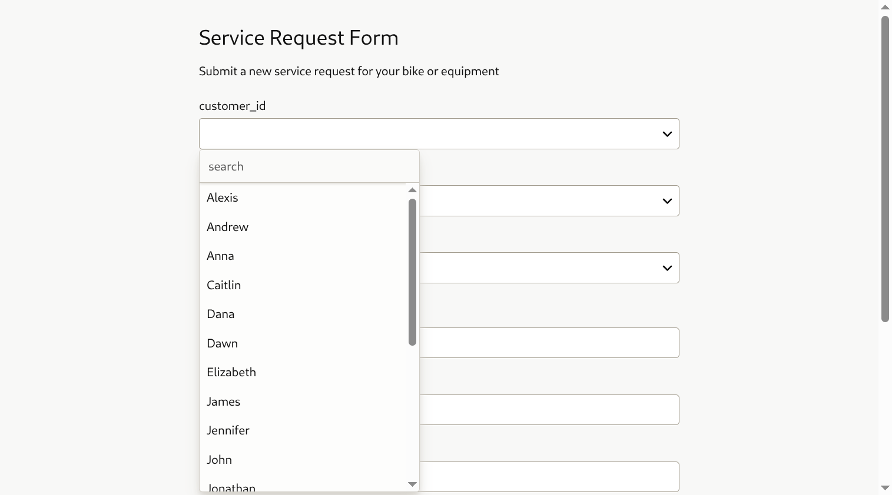

# Working with forms in Mathesar

Mathesar's **form builder** allows you to create public-facing data collection forms that insert records directly into your database tables. Forms provide a simple, user-friendly interface for collecting structured data without requiring database access.

- Forms are based on existing database tables
- All table columns can be included as form fields
- Forms support various field types including text, numbers, dates, foreign keys, and files
- Forms can be shared via public links
- Submission settings are fully customizable

## Creating a form

Forms are created at the schema level and are linked to a specific base table where submitted data will be stored.

1. Navigate to the schema page where you want to create a form
2. Scroll down to the **Forms** section and click **New Form**
3. Select a **Base Table** from the dropdown
4. Enter a **Name** and **Description** for your form (optional)
5. Click **Save**

/// caption
Creating a "Service Request Form" for the Service Requests table.
///

Once created, your form will appear in the Forms list on the schema page.

## Configuring a form

Click on a form name to open the form builder. The builder shows a live preview of your form on the left and an inspector panel on the right.

### Form properties

In the **Properties** section:

- Edit the form **Name** and **Description**
- View the **Base Table** (clicking it navigates to the table)

### Associated role

The **Associated Role** determines which PostgreSQL role inserts records when the form is submitted. By default, forms use the `mathesar` role. You can select a different role for more restrictive permissions.

For more about form roles and security, see the [Forms configuration guide](../administration/forms-config.md).

### Submission settings

Customize the user experience:

- **Button label**: Customize the submit button text (default: "Submit")
- **Confirmation message**: Set a custom success message (default: "Thank you for submitting the form!")
- **Redirect to URL**: Redirect users to a specific URL after submission instead of showing a message

### Form fields

The form automatically includes **all editable fields** from the base table by default:

- **Required fields** are marked with a red asterisk (*)
- **Foreign key columns** appear as dropdown selectors (see below)
- **File columns** appear as file upload fields (see below)

!!! note "Primary keys with dynamic defaults"
    Primary key columns with dynamic default values (such as sequences or UUID generators) are automatically excluded from forms, as these values are generated by the database during insertion.

## Foreign key fields

Foreign key columns appear as dropdown selectors in forms, allowing users to select, or create, related records from the referenced table.

### Foreign key modes

Configure how users interact with foreign key fields by selecting a mode in the field's **Rules** section:

**Can only choose** (default)
: Users can only select an existing record from the related table.

**Can choose or create new**
: Users can select existing records _or_ create a new record in the related table directly from the form. When enabled, additional fields from the related table appear below the foreign key field.

/// caption
When "Can choose or create new" is selected, nested fields appear below the foreign key field for creating new related records.
///

**Must create new**
: Users must always create a new record in the related table. Useful when you want to ensure each form submission creates records in multiple related tables.

To configure a foreign key field:

1. Click on the field in the form preview
2. In the inspector panel, expand the **Rules** section
3. Use the **Related record selection** dropdown to choose the mode

## File upload fields

Forms support file uploads when your table includes file columns.

!!! note "File storage backend required"
    File uploads require a configured [file storage backend](../administration/file-backend-config.md). If no file backend is configured, file columns will not appear in forms. You may also **explicitly disable file uploads via forms** in the same configuration.

When a form includes a file column, users see a file upload button:

File upload capabilities:

- All file types are supported
- Files can be previewed before submission
- Administrators can configure maximum file sizes (see [Forms configuration](../administration/forms-config.md))
- Files are stored in your configured S3-compatible backend

## Sharing a form

To allow external users to submit data through your form, create a public link:

1. Open the form in the form builder
2. Click the **Share** button in the top-right toolbar
3. Click **Create public link**

Once created, you can copy the public URL and share it with anyone. You can also **Regenerate Link** to invalidate the old URL or **Disable Link** to prevent all submissions.

### Link security

- Public form links are unique and cannot be guessed
- Anyone with the link can submit data to your database
- Regenerate links periodically to invalidate old URLs
- Disabling the link prevents all submissions until you create a new link

## Submitting a form

When users access your form via the public link, they see a clean interface with all form fields.

For foreign key fields, users can search and select from existing records:

After filling out required fields and clicking **Submit**, users see a confirmation message:

Users can click **Submit another response** to submit additional entries.

### What happens to submitted data

- Each submission creates a new row in the base table
- Data is validated according to column types and constraints
- Foreign key fields validate that selected records exist
- If a foreign key field is set to create new records, new rows are inserted into the related table
- File uploads are stored in your configured file backend
- The associated PostgreSQL role determines what permissions are used for the insert operation

## Managing forms

### Viewing forms

All forms for a schema are listed in the Forms section on the schema page, showing:

- The form name
- The base table it's connected to
- A public link icon (if shared)

### Editing a form

Click on a form name in the Forms list to open the form builder. Changes are saved automatically.

### Deleting a form

1. Open the form in the form builder
2. Expand the **Actions** section in the inspector panel
3. Click **Delete Form** and confirm

!!! warning "Deleting forms"
    Deleting a form does not delete the records that were submitted through it. Those records remain in your database table. Only the form configuration is deleted.

## Use cases

Forms are particularly useful for:

- **Service requests**: Let customers submit service or support tickets
- **Customer intake**: Collect information from new customers or clients
- **Event registration**: Allow people to sign up for events
- **Contact forms**: Receive inquiries or support requests
- **Surveys**: Gather feedback or research data
- **Job applications**: Collect candidate information

By combining forms with Mathesar's database features like relationships and data validation, you can create sophisticated data collection workflows while maintaining data integrity.
