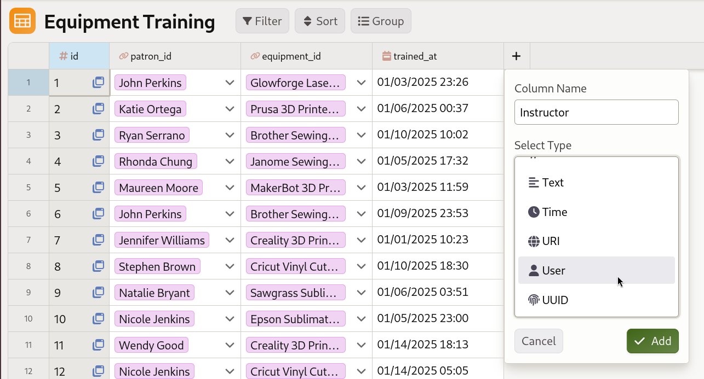
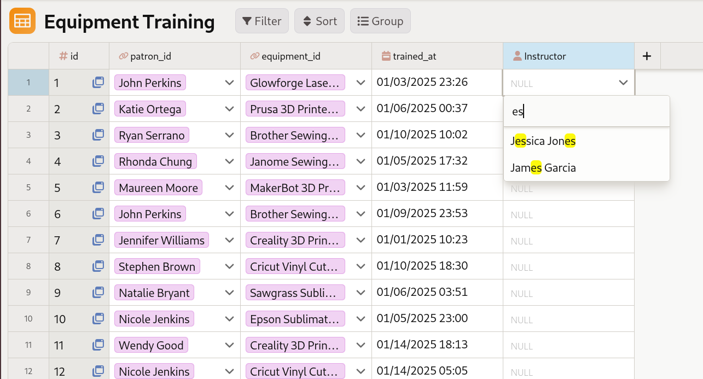
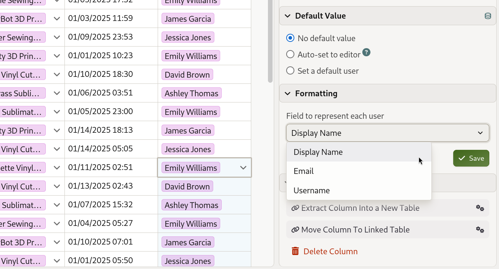
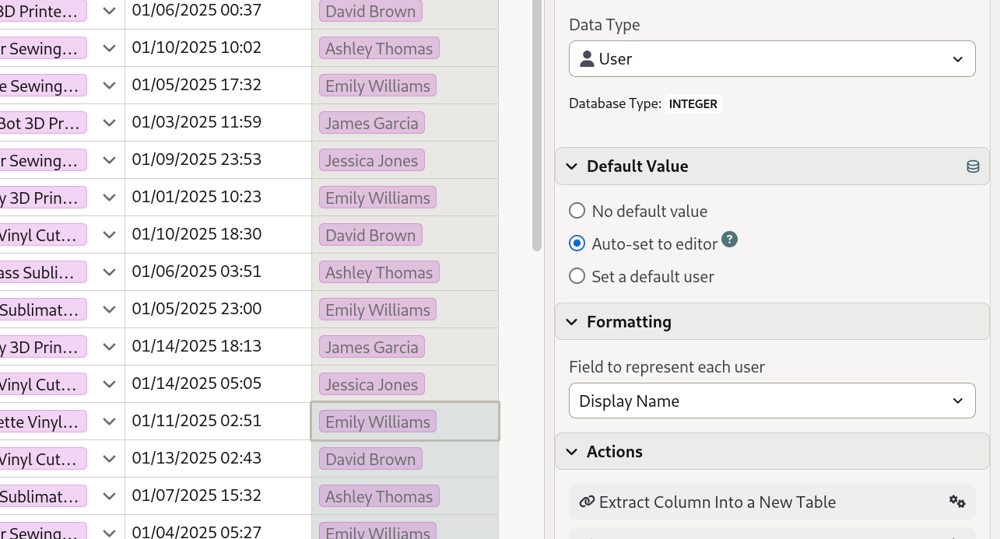

# Working with the user data type

Mathesar's **user data type** allows you to store references to Mathesar users directly in your database tables. This makes it easy to track who created records, who is assigned to tasks, or who last edited a row.

- User columns store Mathesar user IDs (integer values).
- Users are displayed using their username, display name, or email address (configurable).
- You can select users from a searchable list when editing cells.
- User columns support default values, including automatically tracking who last edited a record.

## Adding user columns

/// caption
A library administrator adding an "Instructor" column to track which staff member conducted each training session.
///

Adding a user column works just like adding any other column type in Mathesar:

1. Open the table where you want to add a user column.
2. Click the "+" icon **Add Column**.
3. Choose **User** as the column type and name the column.
4. Save your changes.

Once the user column is created, you'll be able to select a user for each cell directly from the Mathesar UI.

## Selecting users

To select a user for a user cell, click on the cell and use the user selection dialog:

/// caption
Clicking on a user cell opens a searchable dropdown list of all Mathesar users.
///

1. Click on an empty user cell (or double-click a cell with an existing value).
2. A searchable list of Mathesar users will appear.
3. Type to search for users by their username, display name, or email.
4. Click on a user to select them.

You can also clear a user value by selecting the cell and removing the selection.

## Configuring display options

User columns can display users using different fields. You can configure which field to use in the column inspector:

/// caption
In the column inspector, you can choose whether to display users by their username, display name, or email address.
///

1. Open the table containing the user column.
1. Click on the column header to open the column inspector.
1. In the **Display Options** section, find **Field to represent each user**.
1. Choose from:
   - **Username** - The user's login username (default)
   - **Display Name** - The user's full name
   - **Email** - The user's email address

The selected display field will be used throughout Mathesar when showing this column's values.

## Setting default values

User columns support three default value options, which you can configure in the column inspector's **Default Value** section:

/// caption
User columns support three default value modes: no default, auto-set to editor, or set a specific default user. When "auto-set" is chosen, the user column is not editable.
///

### No default

The column has no default value. Users must manually select a value for each row.

### Auto-set to editor

Automatically sets the column to the user who last edited the record. This is useful for tracking who made changes to records.

!!! info "Auto-set columns are read-only"
    When a column is set to "Auto-set to editor", it becomes non-editable in the Mathesar UI. The value is automatically updated whenever a record is modified through Mathesar, including via form submission.

### Set a default user

Sets a specific user as the default value for new rows. When you create a new record, this column will automatically be populated with the selected user.

To set a default user:

1. Open the column inspector for the user column.
1. In the **Default Value** section, select **Set a default user**.
1. Choose the user from the user selection dialog.
1. Save your changes.

## Limitations

### User columns cannot be used in forms

User type columns cannot be added to [forms](./forms.md) because they require authentication to access the list of Mathesar users. Forms can be submitted anonymously, and user fields would not function correctly in that context.

!!! warning "Forms restriction"
    If you try to add a user column to a form, you'll see an error message. User columns are automatically excluded from form field options.

Note that columns with "Auto-set to editor" enabled will still be automatically populated when form submissions are processed, even though the field cannot be included in the form itself.

## Use cases

User columns are useful for:

- **Tracking ownership**: Record who created or owns a record (e.g., "Created By", "Assigned To").
- **Audit trails**: Track who last modified a record using "Auto-set to editor".
- **Task assignment**: Assign tasks or items to specific users.
- **Approval workflows**: Track who approved or reviewed records.

For example, in a **Projects** table, you might have:

- an **Assigned To** column set to a project manager's Mathesar user by default
- a **Last Modified By** column set to "Auto-set to editor" to track recent changes
