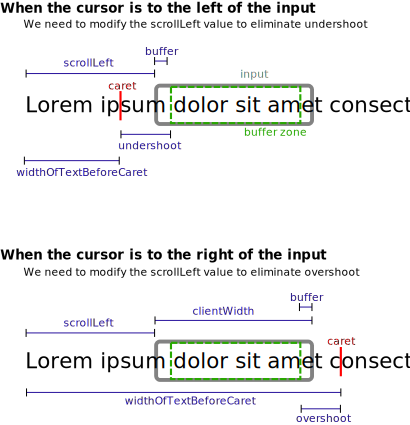

# scrollCaretIntoView

## Why

The `scrollCaretIntoView` function is necessary to work around a browser issue that arises when we want to programmatically set the caret position within the text in an input element.

- In **Firefox**, after we set the caret position, the browser will automatically scroll the text content of the input element so that the caret is visible.

- However, in **Chrome** and **Safari**, the browser doesn't perform any scrolling, which can sometimes leave the caret out of view.

  For example, in our `FormattedInput` component, we use the `beforeInput` event to intercept key presses and programmatically alter the content of the input as well as the text caret position. If we don't use `scrollCaretIntoView`, then we have a [problem](https://github.com/centerofci/mathesar/issues/2758) where entering enough text into the input to fill it results in the caret being positioned beyond the scroll overflow of the text content within the input.

## How

1. (A) If the text fully fits within the input, no changes are made.

1. (B) If the caret is at the end of the text, the text is scrolled all the way to the left.

1. (C) If the caret is at the start of the text, the text is scrolled all the way to the right.

1. (D) If we're still not done (and this case should be somewhat rare), then we copy the content of the text before the caret and insert it into a new hidden DOM element in order to measure its width.

   Having determined the width of the text before the input, then we proceed as described in the following diagram:

   

## Future work

- I didn't test this with RTL text. The only use-case for `scrollCaretIntoView` so far is the `FormattedInput` element, and I don't imagine a pressing need to support RTL text there. We can address this as needed.

## Credit

Some implementation strategies were inspired by [textarea-caret-position](https://github.com/component/textarea-caret-position). (MIT license)
